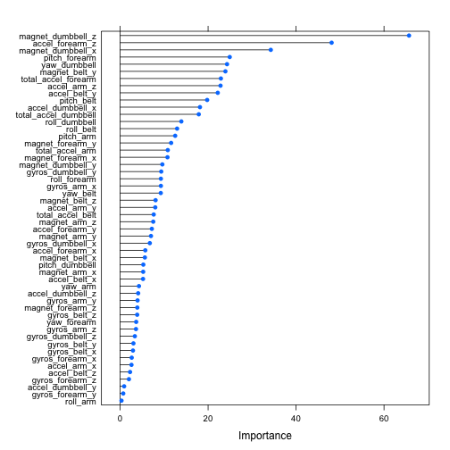

----
title: "README.Rmd"
author: "Maria Velasco"
date: "20 Dec 2014"
output: html_document
---

Reproducing Qualitative Activity Recognition of Weight Lifting Exercises
---------------------------------------------------------------
Maria Velasco, Dec 21 2014

Notes
-----
This document includes the Practical Machine Learning - Coursera Class Dec 2014 Project by mvelasco, published in https://github.com/mvelascoc/MachLearning

Exploratory data analysis done to complete this project included in the exploratory.md file. 

Summary
-------

Movement data is collected [1] performing a set of repetitions on  Unilateral Dumbbell Biceps Curl in five different fashions: exactly according to the specification (Class A), throwing the elbows to the front (Class B), lifting the dumbbell only halfway (Class C), lowering the dumbbell only halfway (Class D) and throwing the hips to the front (Class E).

The purpose of this project is to define model that can predict, based on the movement data, if the movement was done correctly.
From a set of 160 variables, a subset of 12 was selected. Using caret package Gradient Boosted Machine algorithm a model was built with an acuracy of 0.45.

Data Analysis
-------------
To define the features to be included in the algorith, several exploratory analysis were made. Deciding on using the most important features on a linear approach, the selected variables to be included were 

Variable name        | Overall importance
---------------------|-------------------
magnet_dumbbell_z    |   65.68
accel_forearm_z      |   48.09
magnet_dumbbell_x    |   34.25
pitch_forearm        |   24.92
yaw_dumbbell         |   24.31
magnet_belt_y        |   23.94
total_accel_forearm  |   22.91
accel_arm_z          |   22.83
accel_belt_y         |   22.20
pitch_belt           |   19.79
accel_dumbbell_x     |   18.15
total_accel_dumbbell |   17.88


```
## Error: no se pudo encontrar la funci'on "seed"
```

 

Model Selection
---------------

Multiple models were proved using the caret package. Accuracy on the predictions using the training set were recorded, selecting the Gradient Boosted Machine gbm as the best one.
Reported accuracies [1] using random forest model could not be reproduced.

Type of Model | Accuracy
--------------|------
  lm          |  0.297   
  nnet        |  0.1744
  gbm         |  0.482 
  
Model Testing
-------------

Using the testing set of data, the confusion matrix is created. 
The model created does not have the accuracy of the one in the paper, but does have a significant prediction result, considered enough for this homwork project.


```
## Confusion Matrix and Statistics
## 
##           Reference
## Prediction   A   B   C   D   E
##          A 775  79   1   0   0
##          B 530 515 139  14  17
##          C  88 349 705 652 368
##          D   2   6  10 133 366
##          E   0   0   0   5 150
## 
## Overall Statistics
##                                        
##                Accuracy : 0.465        
##                  95% CI : (0.45, 0.479)
##     No Information Rate : 0.284        
##     P-Value [Acc > NIR] : <2e-16       
##                                        
##                   Kappa : 0.333        
##  Mcnemar's Test P-Value : NA           
## 
## Statistics by Class:
## 
##                      Class: A Class: B Class: C Class: D Class: E
## Sensitivity             0.556    0.543    0.825   0.1654   0.1665
## Specificity             0.977    0.823    0.640   0.9063   0.9988
## Pos Pred Value          0.906    0.424    0.326   0.2573   0.9677
## Neg Pred Value          0.847    0.882    0.945   0.8470   0.8419
## Prevalence              0.284    0.194    0.174   0.1639   0.1837
## Detection Rate          0.158    0.105    0.144   0.0271   0.0306
## Detection Prevalence    0.174    0.248    0.441   0.1054   0.0316
## Balanced Accuracy       0.766    0.683    0.732   0.5359   0.5826
```

References
----------
[1] Data for this project comes from http://groupware.les.inf.puc-rio.br/har. 

Velloso, E.; Bulling, A.; Gellersen, H.; Ugulino, W.; Fuks, H. Qualitative Activity Recognition of Weight Lifting Exercises. Proceedings of 4th International Conference in Cooperation with SIGCHI (Augmented Human '13) . Stuttgart, Germany: ACM SIGCHI, 2013.

