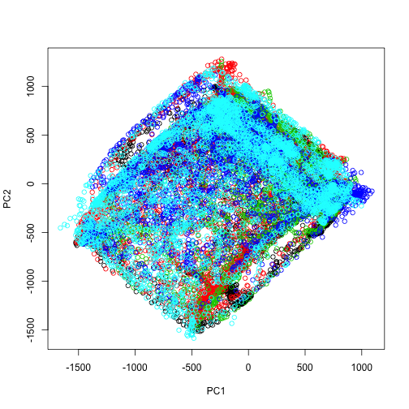
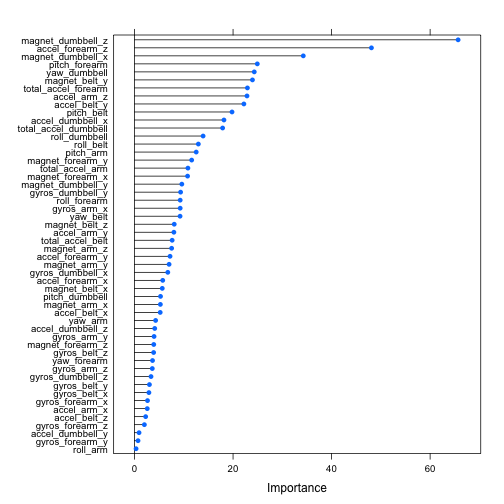

**Data Analysis for Reproducing Qualitative Activity Recognition of Weight Lifting Exercises**
Maria Velasco, Dec 21 2014

Note
This document includes the exploratory data analysisi done for the Practical Machine Learning - Coursera Class Dec 2014 Project by mvelasco, published in https://github.com/mvelascoc/MachLearning

References
Data for this project comes from http://groupware.les.inf.puc-rio.br/har. 
Velloso, E.; Bulling, A.; Gellersen, H.; Ugulino, W.; Fuks, H. Qualitative Activity Recognition of Weight Lifting Exercises. Proceedings of 4th International Conference in Cooperation with SIGCHI (Augmented Human '13) . Stuttgart, Germany: ACM SIGCHI, 2013.

*Reviewing the data*
Data for the project includes 160 variables. In order to review them and find the significant ones, the following summaries and graphics were useful.

```r
traindata <- read.csv("pml-training.csv")
testdata <- read.csv("pml-testing.csv")

#reviewing types of data and selecting initial set of numeric and significant variables
summary(traindata)
```

```
##        X            user_name    raw_timestamp_part_1 raw_timestamp_part_2
##  Min.   :    1   adelmo  :3892   Min.   :1.32e+09     Min.   :   294      
##  1st Qu.: 4906   carlitos:3112   1st Qu.:1.32e+09     1st Qu.:252912      
##  Median : 9812   charles :3536   Median :1.32e+09     Median :496380      
##  Mean   : 9812   eurico  :3070   Mean   :1.32e+09     Mean   :500656      
##  3rd Qu.:14717   jeremy  :3402   3rd Qu.:1.32e+09     3rd Qu.:751891      
##  Max.   :19622   pedro   :2610   Max.   :1.32e+09     Max.   :998801      
##                                                                           
##           cvtd_timestamp  new_window    num_window    roll_belt    
##  28/11/2011 14:14: 1498   no :19216   Min.   :  1   Min.   :-28.9  
##  05/12/2011 11:24: 1497   yes:  406   1st Qu.:222   1st Qu.:  1.1  
##  30/11/2011 17:11: 1440               Median :424   Median :113.0  
##  05/12/2011 11:25: 1425               Mean   :431   Mean   : 64.4  
##  02/12/2011 14:57: 1380               3rd Qu.:644   3rd Qu.:123.0  
##  02/12/2011 13:34: 1375               Max.   :864   Max.   :162.0  
##  (Other)         :11007                                            
##    pitch_belt        yaw_belt      total_accel_belt kurtosis_roll_belt
##  Min.   :-55.80   Min.   :-180.0   Min.   : 0.0              :19216   
##  1st Qu.:  1.76   1st Qu.: -88.3   1st Qu.: 3.0     #DIV/0!  :   10   
##  Median :  5.28   Median : -13.0   Median :17.0     -1.908453:    2   
##  Mean   :  0.31   Mean   : -11.2   Mean   :11.3     -0.016850:    1   
##  3rd Qu.: 14.90   3rd Qu.:  12.9   3rd Qu.:18.0     -0.021024:    1   
##  Max.   : 60.30   Max.   : 179.0   Max.   :29.0     -0.025513:    1   
##                                                     (Other)  :  391   
##  kurtosis_picth_belt kurtosis_yaw_belt skewness_roll_belt
##           :19216            :19216              :19216   
##  #DIV/0!  :   32     #DIV/0!:  406     #DIV/0!  :    9   
##  47.000000:    4                       0.000000 :    4   
##  -0.150950:    3                       0.422463 :    2   
##  -0.684748:    3                       -0.003095:    1   
##  -1.750749:    3                       -0.010002:    1   
##  (Other)  :  361                       (Other)  :  389   
##  skewness_roll_belt.1 skewness_yaw_belt max_roll_belt   max_picth_belt 
##           :19216             :19216     Min.   :-94     Min.   : 3     
##  #DIV/0!  :   32      #DIV/0!:  406     1st Qu.:-88     1st Qu.: 5     
##  0.000000 :    4                        Median : -5     Median :18     
##  -2.156553:    3                        Mean   : -7     Mean   :13     
##  -3.072669:    3                        3rd Qu.: 18     3rd Qu.:19     
##  -6.324555:    3                        Max.   :180     Max.   :30     
##  (Other)  :  361                        NA's   :19216   NA's   :19216  
##   max_yaw_belt   min_roll_belt   min_pitch_belt   min_yaw_belt  
##         :19216   Min.   :-180    Min.   : 0             :19216  
##  -1.1   :   30   1st Qu.: -88    1st Qu.: 3      -1.1   :   30  
##  -1.4   :   29   Median :  -8    Median :16      -1.4   :   29  
##  -1.2   :   26   Mean   : -10    Mean   :11      -1.2   :   26  
##  -0.9   :   24   3rd Qu.:   9    3rd Qu.:17      -0.9   :   24  
##  -1.3   :   22   Max.   : 173    Max.   :23      -1.3   :   22  
##  (Other):  275   NA's   :19216   NA's   :19216   (Other):  275  
##  amplitude_roll_belt amplitude_pitch_belt amplitude_yaw_belt
##  Min.   :  0         Min.   : 0                  :19216     
##  1st Qu.:  0         1st Qu.: 1           #DIV/0!:   10     
##  Median :  1         Median : 1           0.00   :   12     
##  Mean   :  4         Mean   : 2           0.0000 :  384     
##  3rd Qu.:  2         3rd Qu.: 2                             
##  Max.   :360         Max.   :12                             
##  NA's   :19216       NA's   :19216                          
##  var_total_accel_belt avg_roll_belt   stddev_roll_belt var_roll_belt  
##  Min.   : 0           Min.   :-27     Min.   : 0       Min.   :  0    
##  1st Qu.: 0           1st Qu.:  1     1st Qu.: 0       1st Qu.:  0    
##  Median : 0           Median :116     Median : 0       Median :  0    
##  Mean   : 1           Mean   : 68     Mean   : 1       Mean   :  8    
##  3rd Qu.: 0           3rd Qu.:123     3rd Qu.: 1       3rd Qu.:  0    
##  Max.   :16           Max.   :157     Max.   :14       Max.   :201    
##  NA's   :19216        NA's   :19216   NA's   :19216    NA's   :19216  
##  avg_pitch_belt  stddev_pitch_belt var_pitch_belt   avg_yaw_belt  
##  Min.   :-51     Min.   :0         Min.   : 0      Min.   :-138   
##  1st Qu.:  2     1st Qu.:0         1st Qu.: 0      1st Qu.: -88   
##  Median :  5     Median :0         Median : 0      Median :  -7   
##  Mean   :  1     Mean   :1         Mean   : 1      Mean   :  -9   
##  3rd Qu.: 16     3rd Qu.:1         3rd Qu.: 0      3rd Qu.:  14   
##  Max.   : 60     Max.   :4         Max.   :16      Max.   : 174   
##  NA's   :19216   NA's   :19216     NA's   :19216   NA's   :19216  
##  stddev_yaw_belt  var_yaw_belt    gyros_belt_x      gyros_belt_y    
##  Min.   :  0     Min.   :    0   Min.   :-1.0400   Min.   :-0.6400  
##  1st Qu.:  0     1st Qu.:    0   1st Qu.:-0.0300   1st Qu.: 0.0000  
##  Median :  0     Median :    0   Median : 0.0300   Median : 0.0200  
##  Mean   :  1     Mean   :  107   Mean   :-0.0056   Mean   : 0.0396  
##  3rd Qu.:  1     3rd Qu.:    0   3rd Qu.: 0.1100   3rd Qu.: 0.1100  
##  Max.   :177     Max.   :31183   Max.   : 2.2200   Max.   : 0.6400  
##  NA's   :19216   NA's   :19216                                      
##   gyros_belt_z     accel_belt_x      accel_belt_y    accel_belt_z   
##  Min.   :-1.460   Min.   :-120.00   Min.   :-69.0   Min.   :-275.0  
##  1st Qu.:-0.200   1st Qu.: -21.00   1st Qu.:  3.0   1st Qu.:-162.0  
##  Median :-0.100   Median : -15.00   Median : 35.0   Median :-152.0  
##  Mean   :-0.131   Mean   :  -5.59   Mean   : 30.1   Mean   : -72.6  
##  3rd Qu.:-0.020   3rd Qu.:  -5.00   3rd Qu.: 61.0   3rd Qu.:  27.0  
##  Max.   : 1.620   Max.   :  85.00   Max.   :164.0   Max.   : 105.0  
##                                                                     
##  magnet_belt_x   magnet_belt_y magnet_belt_z     roll_arm     
##  Min.   :-52.0   Min.   :354   Min.   :-623   Min.   :-180.0  
##  1st Qu.:  9.0   1st Qu.:581   1st Qu.:-375   1st Qu.: -31.8  
##  Median : 35.0   Median :601   Median :-320   Median :   0.0  
##  Mean   : 55.6   Mean   :594   Mean   :-346   Mean   :  17.8  
##  3rd Qu.: 59.0   3rd Qu.:610   3rd Qu.:-306   3rd Qu.:  77.3  
##  Max.   :485.0   Max.   :673   Max.   : 293   Max.   : 180.0  
##                                                               
##    pitch_arm         yaw_arm        total_accel_arm var_accel_arm  
##  Min.   :-88.80   Min.   :-180.00   Min.   : 1.0    Min.   :  0    
##  1st Qu.:-25.90   1st Qu.: -43.10   1st Qu.:17.0    1st Qu.:  9    
##  Median :  0.00   Median :   0.00   Median :27.0    Median : 41    
##  Mean   : -4.61   Mean   :  -0.62   Mean   :25.5    Mean   : 53    
##  3rd Qu.: 11.20   3rd Qu.:  45.88   3rd Qu.:33.0    3rd Qu.: 76    
##  Max.   : 88.50   Max.   : 180.00   Max.   :66.0    Max.   :332    
##                                                     NA's   :19216  
##   avg_roll_arm   stddev_roll_arm  var_roll_arm   avg_pitch_arm  
##  Min.   :-167    Min.   :  0     Min.   :    0   Min.   :-82    
##  1st Qu.: -38    1st Qu.:  1     1st Qu.:    2   1st Qu.:-23    
##  Median :   0    Median :  6     Median :   33   Median :  0    
##  Mean   :  13    Mean   : 11     Mean   :  417   Mean   : -5    
##  3rd Qu.:  76    3rd Qu.: 15     3rd Qu.:  223   3rd Qu.:  8    
##  Max.   : 163    Max.   :162     Max.   :26232   Max.   : 76    
##  NA's   :19216   NA's   :19216   NA's   :19216   NA's   :19216  
##  stddev_pitch_arm var_pitch_arm    avg_yaw_arm    stddev_yaw_arm 
##  Min.   : 0       Min.   :   0    Min.   :-173    Min.   :  0    
##  1st Qu.: 2       1st Qu.:   3    1st Qu.: -29    1st Qu.:  3    
##  Median : 8       Median :  66    Median :   0    Median : 17    
##  Mean   :10       Mean   : 196    Mean   :   2    Mean   : 22    
##  3rd Qu.:16       3rd Qu.: 267    3rd Qu.:  38    3rd Qu.: 36    
##  Max.   :43       Max.   :1885    Max.   : 152    Max.   :177    
##  NA's   :19216    NA's   :19216   NA's   :19216   NA's   :19216  
##   var_yaw_arm     gyros_arm_x      gyros_arm_y      gyros_arm_z   
##  Min.   :    0   Min.   :-6.370   Min.   :-3.440   Min.   :-2.33  
##  1st Qu.:    7   1st Qu.:-1.330   1st Qu.:-0.800   1st Qu.:-0.07  
##  Median :  278   Median : 0.080   Median :-0.240   Median : 0.23  
##  Mean   : 1056   Mean   : 0.043   Mean   :-0.257   Mean   : 0.27  
##  3rd Qu.: 1295   3rd Qu.: 1.570   3rd Qu.: 0.140   3rd Qu.: 0.72  
##  Max.   :31345   Max.   : 4.870   Max.   : 2.840   Max.   : 3.02  
##  NA's   :19216                                                    
##   accel_arm_x      accel_arm_y      accel_arm_z      magnet_arm_x 
##  Min.   :-404.0   Min.   :-318.0   Min.   :-636.0   Min.   :-584  
##  1st Qu.:-242.0   1st Qu.: -54.0   1st Qu.:-143.0   1st Qu.:-300  
##  Median : -44.0   Median :  14.0   Median : -47.0   Median : 289  
##  Mean   : -60.2   Mean   :  32.6   Mean   : -71.2   Mean   : 192  
##  3rd Qu.:  84.0   3rd Qu.: 139.0   3rd Qu.:  23.0   3rd Qu.: 637  
##  Max.   : 437.0   Max.   : 308.0   Max.   : 292.0   Max.   : 782  
##                                                                   
##   magnet_arm_y   magnet_arm_z  kurtosis_roll_arm kurtosis_picth_arm
##  Min.   :-392   Min.   :-597           :19216            :19216    
##  1st Qu.:  -9   1st Qu.: 131   #DIV/0! :   78    #DIV/0! :   80    
##  Median : 202   Median : 444   -0.02438:    1    -0.00484:    1    
##  Mean   : 157   Mean   : 306   -0.04190:    1    -0.01311:    1    
##  3rd Qu.: 323   3rd Qu.: 545   -0.05051:    1    -0.02967:    1    
##  Max.   : 583   Max.   : 694   -0.05695:    1    -0.07394:    1    
##                                (Other) :  324    (Other) :  322    
##  kurtosis_yaw_arm skewness_roll_arm skewness_pitch_arm skewness_yaw_arm
##          :19216           :19216            :19216             :19216  
##  #DIV/0! :   11   #DIV/0! :   77    #DIV/0! :   80     #DIV/0! :   11  
##  0.55844 :    2   -0.00051:    1    -0.00184:    1     -1.62032:    2  
##  0.65132 :    2   -0.00696:    1    -0.01185:    1     0.55053 :    2  
##  -0.01548:    1   -0.01884:    1    -0.01247:    1     -0.00311:    1  
##  -0.01749:    1   -0.03359:    1    -0.02063:    1     -0.00562:    1  
##  (Other) :  389   (Other) :  325    (Other) :  322     (Other) :  389  
##   max_roll_arm   max_picth_arm    max_yaw_arm     min_roll_arm  
##  Min.   :-73     Min.   :-173    Min.   : 4      Min.   :-89    
##  1st Qu.:  0     1st Qu.:  -2    1st Qu.:29      1st Qu.:-42    
##  Median :  5     Median :  23    Median :34      Median :-22    
##  Mean   : 11     Mean   :  36    Mean   :35      Mean   :-21    
##  3rd Qu.: 27     3rd Qu.:  96    3rd Qu.:41      3rd Qu.:  0    
##  Max.   : 86     Max.   : 180    Max.   :65      Max.   : 66    
##  NA's   :19216   NA's   :19216   NA's   :19216   NA's   :19216  
##  min_pitch_arm    min_yaw_arm    amplitude_roll_arm amplitude_pitch_arm
##  Min.   :-180    Min.   : 1      Min.   :  0        Min.   :  0        
##  1st Qu.: -73    1st Qu.: 8      1st Qu.:  5        1st Qu.: 10        
##  Median : -34    Median :13      Median : 28        Median : 55        
##  Mean   : -34    Mean   :15      Mean   : 32        Mean   : 70        
##  3rd Qu.:   0    3rd Qu.:19      3rd Qu.: 51        3rd Qu.:115        
##  Max.   : 152    Max.   :38      Max.   :120        Max.   :360        
##  NA's   :19216   NA's   :19216   NA's   :19216      NA's   :19216      
##  amplitude_yaw_arm roll_dumbbell    pitch_dumbbell    yaw_dumbbell    
##  Min.   : 0        Min.   :-153.7   Min.   :-149.6   Min.   :-150.87  
##  1st Qu.:13        1st Qu.: -18.5   1st Qu.: -40.9   1st Qu.: -77.64  
##  Median :22        Median :  48.2   Median : -21.0   Median :  -3.32  
##  Mean   :21        Mean   :  23.8   Mean   : -10.8   Mean   :   1.67  
##  3rd Qu.:29        3rd Qu.:  67.6   3rd Qu.:  17.5   3rd Qu.:  79.64  
##  Max.   :52        Max.   : 153.6   Max.   : 149.4   Max.   : 154.95  
##  NA's   :19216                                                        
##  kurtosis_roll_dumbbell kurtosis_picth_dumbbell kurtosis_yaw_dumbbell
##         :19216                 :19216                  :19216        
##  #DIV/0!:    5          #DIV/0!:    2           #DIV/0!:  406        
##  -0.2583:    2          -0.5464:    2                                
##  -0.3705:    2          -0.9334:    2                                
##  -0.5855:    2          -2.0833:    2                                
##  -2.0851:    2          -2.0851:    2                                
##  (Other):  393          (Other):  396                                
##  skewness_roll_dumbbell skewness_pitch_dumbbell skewness_yaw_dumbbell
##         :19216                 :19216                  :19216        
##  #DIV/0!:    4          -0.2328:    2           #DIV/0!:  406        
##  -0.9324:    2          -0.3521:    2                                
##  0.1110 :    2          -0.7036:    2                                
##  1.0312 :    2          0.1090 :    2                                
##  -0.0082:    1          1.0326 :    2                                
##  (Other):  395          (Other):  396                                
##  max_roll_dumbbell max_picth_dumbbell max_yaw_dumbbell min_roll_dumbbell
##  Min.   :-70       Min.   :-113              :19216    Min.   :-150     
##  1st Qu.:-27       1st Qu.: -67       -0.6   :   20    1st Qu.: -60     
##  Median : 15       Median :  40       0.2    :   19    Median : -44     
##  Mean   : 14       Mean   :  33       -0.8   :   18    Mean   : -41     
##  3rd Qu.: 51       3rd Qu.: 133       -0.3   :   16    3rd Qu.: -25     
##  Max.   :137       Max.   : 155       -0.2   :   15    Max.   :  73     
##  NA's   :19216     NA's   :19216      (Other):  318    NA's   :19216    
##  min_pitch_dumbbell min_yaw_dumbbell amplitude_roll_dumbbell
##  Min.   :-147              :19216    Min.   :  0            
##  1st Qu.: -92       -0.6   :   20    1st Qu.: 15            
##  Median : -66       0.2    :   19    Median : 35            
##  Mean   : -33       -0.8   :   18    Mean   : 55            
##  3rd Qu.:  21       -0.3   :   16    3rd Qu.: 81            
##  Max.   : 121       -0.2   :   15    Max.   :256            
##  NA's   :19216      (Other):  318    NA's   :19216          
##  amplitude_pitch_dumbbell amplitude_yaw_dumbbell total_accel_dumbbell
##  Min.   :  0                     :19216          Min.   : 0.0        
##  1st Qu.: 17              #DIV/0!:    5          1st Qu.: 4.0        
##  Median : 42              0.00   :  401          Median :10.0        
##  Mean   : 66                                     Mean   :13.7        
##  3rd Qu.:100                                     3rd Qu.:19.0        
##  Max.   :274                                     Max.   :58.0        
##  NA's   :19216                                                       
##  var_accel_dumbbell avg_roll_dumbbell stddev_roll_dumbbell
##  Min.   :  0        Min.   :-129      Min.   :  0         
##  1st Qu.:  0        1st Qu.: -12      1st Qu.:  5         
##  Median :  1        Median :  48      Median : 12         
##  Mean   :  4        Mean   :  24      Mean   : 21         
##  3rd Qu.:  3        3rd Qu.:  64      3rd Qu.: 26         
##  Max.   :230        Max.   : 126      Max.   :124         
##  NA's   :19216      NA's   :19216     NA's   :19216       
##  var_roll_dumbbell avg_pitch_dumbbell stddev_pitch_dumbbell
##  Min.   :    0     Min.   :-71        Min.   : 0           
##  1st Qu.:   22     1st Qu.:-42        1st Qu.: 3           
##  Median :  149     Median :-20        Median : 8           
##  Mean   : 1020     Mean   :-12        Mean   :13           
##  3rd Qu.:  695     3rd Qu.: 13        3rd Qu.:19           
##  Max.   :15321     Max.   : 94        Max.   :83           
##  NA's   :19216     NA's   :19216      NA's   :19216        
##  var_pitch_dumbbell avg_yaw_dumbbell stddev_yaw_dumbbell var_yaw_dumbbell
##  Min.   :   0       Min.   :-118     Min.   :  0         Min.   :    0   
##  1st Qu.:  12       1st Qu.: -77     1st Qu.:  4         1st Qu.:   15   
##  Median :  65       Median :  -5     Median : 10         Median :  105   
##  Mean   : 350       Mean   :   0     Mean   : 17         Mean   :  590   
##  3rd Qu.: 370       3rd Qu.:  71     3rd Qu.: 25         3rd Qu.:  609   
##  Max.   :6836       Max.   : 135     Max.   :107         Max.   :11468   
##  NA's   :19216      NA's   :19216    NA's   :19216       NA's   :19216   
##  gyros_dumbbell_x  gyros_dumbbell_y gyros_dumbbell_z accel_dumbbell_x
##  Min.   :-204.00   Min.   :-2.10    Min.   : -2.4    Min.   :-419.0  
##  1st Qu.:  -0.03   1st Qu.:-0.14    1st Qu.: -0.3    1st Qu.: -50.0  
##  Median :   0.13   Median : 0.03    Median : -0.1    Median :  -8.0  
##  Mean   :   0.16   Mean   : 0.05    Mean   : -0.1    Mean   : -28.6  
##  3rd Qu.:   0.35   3rd Qu.: 0.21    3rd Qu.:  0.0    3rd Qu.:  11.0  
##  Max.   :   2.22   Max.   :52.00    Max.   :317.0    Max.   : 235.0  
##                                                                      
##  accel_dumbbell_y accel_dumbbell_z magnet_dumbbell_x magnet_dumbbell_y
##  Min.   :-189.0   Min.   :-334.0   Min.   :-643      Min.   :-3600    
##  1st Qu.:  -8.0   1st Qu.:-142.0   1st Qu.:-535      1st Qu.:  231    
##  Median :  41.5   Median :  -1.0   Median :-479      Median :  311    
##  Mean   :  52.6   Mean   : -38.3   Mean   :-328      Mean   :  221    
##  3rd Qu.: 111.0   3rd Qu.:  38.0   3rd Qu.:-304      3rd Qu.:  390    
##  Max.   : 315.0   Max.   : 318.0   Max.   : 592      Max.   :  633    
##                                                                       
##  magnet_dumbbell_z  roll_forearm     pitch_forearm     yaw_forearm    
##  Min.   :-262.0    Min.   :-180.00   Min.   :-72.50   Min.   :-180.0  
##  1st Qu.: -45.0    1st Qu.:  -0.74   1st Qu.:  0.00   1st Qu.: -68.6  
##  Median :  13.0    Median :  21.70   Median :  9.24   Median :   0.0  
##  Mean   :  46.1    Mean   :  33.83   Mean   : 10.71   Mean   :  19.2  
##  3rd Qu.:  95.0    3rd Qu.: 140.00   3rd Qu.: 28.40   3rd Qu.: 110.0  
##  Max.   : 452.0    Max.   : 180.00   Max.   : 89.80   Max.   : 180.0  
##                                                                       
##  kurtosis_roll_forearm kurtosis_picth_forearm kurtosis_yaw_forearm
##         :19216                :19216                 :19216       
##  #DIV/0!:   84         #DIV/0!:   85          #DIV/0!:  406       
##  -0.8079:    2         -0.0073:    1                              
##  -0.9169:    2         -0.0442:    1                              
##  -0.0227:    1         -0.0489:    1                              
##  -0.0359:    1         -0.0523:    1                              
##  (Other):  316         (Other):  317                              
##  skewness_roll_forearm skewness_pitch_forearm skewness_yaw_forearm
##         :19216                :19216                 :19216       
##  #DIV/0!:   83         #DIV/0!:   85          #DIV/0!:  406       
##  -0.1912:    2         0.0000 :    4                              
##  -0.4126:    2         -0.6992:    2                              
##  -0.0004:    1         -0.0113:    1                              
##  -0.0013:    1         -0.0131:    1                              
##  (Other):  317         (Other):  313                              
##  max_roll_forearm max_picth_forearm max_yaw_forearm min_roll_forearm
##  Min.   :-67      Min.   :-151             :19216   Min.   :-72     
##  1st Qu.:  0      1st Qu.:   0      #DIV/0!:   84   1st Qu.: -6     
##  Median : 27      Median : 113      -1.2   :   32   Median :  0     
##  Mean   : 24      Mean   :  81      -1.3   :   31   Mean   :  0     
##  3rd Qu.: 46      3rd Qu.: 175      -1.4   :   24   3rd Qu.: 12     
##  Max.   : 90      Max.   : 180      -1.5   :   24   Max.   : 62     
##  NA's   :19216    NA's   :19216     (Other):  211   NA's   :19216   
##  min_pitch_forearm min_yaw_forearm amplitude_roll_forearm
##  Min.   :-180             :19216   Min.   :  0           
##  1st Qu.:-175      #DIV/0!:   84   1st Qu.:  1           
##  Median : -61      -1.2   :   32   Median : 18           
##  Mean   : -58      -1.3   :   31   Mean   : 25           
##  3rd Qu.:   0      -1.4   :   24   3rd Qu.: 40           
##  Max.   : 167      -1.5   :   24   Max.   :126           
##  NA's   :19216     (Other):  211   NA's   :19216         
##  amplitude_pitch_forearm amplitude_yaw_forearm total_accel_forearm
##  Min.   :  0                    :19216         Min.   :  0.0      
##  1st Qu.:  2             #DIV/0!:   84         1st Qu.: 29.0      
##  Median : 84             0.00   :  322         Median : 36.0      
##  Mean   :139                                   Mean   : 34.7      
##  3rd Qu.:350                                   3rd Qu.: 41.0      
##  Max.   :360                                   Max.   :108.0      
##  NA's   :19216                                                    
##  var_accel_forearm avg_roll_forearm stddev_roll_forearm var_roll_forearm
##  Min.   :  0       Min.   :-177     Min.   :  0         Min.   :    0   
##  1st Qu.:  7       1st Qu.:  -1     1st Qu.:  0         1st Qu.:    0   
##  Median : 21       Median :  11     Median :  8         Median :   64   
##  Mean   : 34       Mean   :  33     Mean   : 42         Mean   : 5274   
##  3rd Qu.: 51       3rd Qu.: 107     3rd Qu.: 85         3rd Qu.: 7289   
##  Max.   :173       Max.   : 177     Max.   :179         Max.   :32102   
##  NA's   :19216     NA's   :19216    NA's   :19216       NA's   :19216   
##  avg_pitch_forearm stddev_pitch_forearm var_pitch_forearm avg_yaw_forearm
##  Min.   :-68       Min.   : 0           Min.   :   0      Min.   :-155   
##  1st Qu.:  0       1st Qu.: 0           1st Qu.:   0      1st Qu.: -26   
##  Median : 12       Median : 6           Median :  30      Median :   0   
##  Mean   : 12       Mean   : 8           Mean   : 140      Mean   :  18   
##  3rd Qu.: 28       3rd Qu.:13           3rd Qu.: 166      3rd Qu.:  86   
##  Max.   : 72       Max.   :48           Max.   :2280      Max.   : 169   
##  NA's   :19216     NA's   :19216        NA's   :19216     NA's   :19216  
##  stddev_yaw_forearm var_yaw_forearm gyros_forearm_x   gyros_forearm_y 
##  Min.   :  0        Min.   :    0   Min.   :-22.000   Min.   : -7.02  
##  1st Qu.:  1        1st Qu.:    0   1st Qu.: -0.220   1st Qu.: -1.46  
##  Median : 25        Median :  612   Median :  0.050   Median :  0.03  
##  Mean   : 45        Mean   : 4640   Mean   :  0.158   Mean   :  0.08  
##  3rd Qu.: 86        3rd Qu.: 7368   3rd Qu.:  0.560   3rd Qu.:  1.62  
##  Max.   :198        Max.   :39009   Max.   :  3.970   Max.   :311.00  
##  NA's   :19216      NA's   :19216                                     
##  gyros_forearm_z  accel_forearm_x  accel_forearm_y accel_forearm_z 
##  Min.   : -8.09   Min.   :-498.0   Min.   :-632    Min.   :-446.0  
##  1st Qu.: -0.18   1st Qu.:-178.0   1st Qu.:  57    1st Qu.:-182.0  
##  Median :  0.08   Median : -57.0   Median : 201    Median : -39.0  
##  Mean   :  0.15   Mean   : -61.7   Mean   : 164    Mean   : -55.3  
##  3rd Qu.:  0.49   3rd Qu.:  76.0   3rd Qu.: 312    3rd Qu.:  26.0  
##  Max.   :231.00   Max.   : 477.0   Max.   : 923    Max.   : 291.0  
##                                                                    
##  magnet_forearm_x magnet_forearm_y magnet_forearm_z classe  
##  Min.   :-1280    Min.   :-896     Min.   :-973     A:5580  
##  1st Qu.: -616    1st Qu.:   2     1st Qu.: 191     B:3797  
##  Median : -378    Median : 591     Median : 511     C:3422  
##  Mean   : -313    Mean   : 380     Mean   : 394     D:3216  
##  3rd Qu.:  -73    3rd Qu.: 737     3rd Qu.: 653     E:3607  
##  Max.   :  672    Max.   :1480     Max.   :1090             
## 
```

```r
numericdata <- subset(traindata, select=c("roll_belt","pitch_belt", "yaw_belt", "total_accel_belt", "gyros_belt_x", "gyros_belt_y", "gyros_belt_z", "accel_belt_x", "accel_belt_y", "accel_belt_z", "magnet_belt_x", "magnet_belt_y", "magnet_belt_z", "roll_arm", "pitch_arm", "yaw_arm", "total_accel_arm", "gyros_arm_x", "gyros_arm_y", "gyros_arm_z", "accel_arm_x", "accel_arm_y", "accel_arm_z", "magnet_arm_x", "magnet_arm_y", "magnet_arm_z", "roll_dumbbell", "pitch_dumbbell", "yaw_dumbbell", "total_accel_dumbbell", "gyros_dumbbell_x", "gyros_dumbbell_y", "gyros_dumbbell_z", "accel_dumbbell_x", "accel_dumbbell_y", "accel_dumbbell_z", "magnet_dumbbell_x", "magnet_dumbbell_y", "magnet_dumbbell_z", "roll_forearm", "pitch_forearm", "yaw_forearm", "total_accel_forearm", "gyros_forearm_x", "gyros_forearm_y", "gyros_forearm_z", "accel_forearm_x", "accel_forearm_y", "accel_forearm_z", "magnet_forearm_x", "magnet_forearm_y", "magnet_forearm_z"))

target <- subset(traindata, select=c("X", "classe"))

# checking if some data are similar... some variables can be eliminated. In particular
# total_accel_belt accel_belt_y gyros_dumbbell_z
M <- cor(numericdata)
diag(M) <- 0
which(M > 0.9, arr.ind=T)
```

```
##                  row col
## total_accel_belt   4   1
## accel_belt_y       9   1
## roll_belt          1   4
## accel_belt_y       9   4
## roll_belt          1   9
## total_accel_belt   4   9
## gyros_forearm_z   46  33
## gyros_dumbbell_z  33  46
```

```r
# Checking or principal components, the approach does not seem useful for this project
prComp <- prcomp(numericdata)
plot(prComp$x[,1],prComp$x[,2], col=traindata$classe, xlab="PC1", ylab="PC2")
```

 

```r
plot(prComp$x[,1], traindata$classe, xlab="PC1", ylab="Classe")
```

 

```r
plot(prComp$x[,2], traindata$classe, xlab="PC2", ylab="Classe")
```

 

```r
plot(prComp$x[,3], traindata$classe, xlab="PC3", ylab="Classe")

#Still have too maney features, so
fit <- lm(as.numeric(target$classe) ~ ., data=numericdata)
summary(fit)
```

```
## 
## Call:
## lm(formula = as.numeric(target$classe) ~ ., data = numericdata)
## 
## Residuals:
##    Min     1Q Median     3Q    Max 
## -4.422 -0.693 -0.062  0.646  5.803 
## 
## Coefficients:
##                       Estimate Std. Error t value Pr(>|t|)    
## (Intercept)           8.26e+00   4.29e-01   19.25  < 2e-16 ***
## roll_belt             2.60e-02   2.00e-03   12.95  < 2e-16 ***
## pitch_belt            3.82e-02   1.93e-03   19.79  < 2e-16 ***
## yaw_belt             -3.69e-03   3.99e-04   -9.24  < 2e-16 ***
## total_accel_belt      5.12e-02   6.70e-03    7.64  2.3e-14 ***
## gyros_belt_x          2.11e-01   7.22e-02    2.92  0.00349 ** 
## gyros_belt_y         -5.85e-01   1.93e-01   -3.03  0.00248 ** 
## gyros_belt_z          2.00e-01   5.15e-02    3.88  0.00010 ***
## accel_belt_x         -6.17e-03   1.18e-03   -5.21  1.9e-07 ***
## accel_belt_y         -2.58e-02   1.16e-03  -22.20  < 2e-16 ***
## accel_belt_z          2.51e-03   1.11e-03    2.26  0.02373 *  
## magnet_belt_x        -2.54e-03   4.51e-04   -5.63  1.8e-08 ***
## magnet_belt_y        -1.39e-02   5.81e-04  -23.94  < 2e-16 ***
## magnet_belt_z         2.41e-03   3.00e-04    8.06  8.0e-16 ***
## roll_arm             -4.64e-05   1.47e-04   -0.31  0.75294    
## pitch_arm            -4.24e-03   3.39e-04  -12.52  < 2e-16 ***
## yaw_arm               5.26e-04   1.23e-04    4.28  1.8e-05 ***
## total_accel_arm       1.18e-02   1.09e-03   10.84  < 2e-16 ***
## gyros_arm_x           1.05e-01   1.13e-02    9.27  < 2e-16 ***
## gyros_arm_y           1.10e-01   2.76e-02    3.97  7.3e-05 ***
## gyros_arm_z          -7.67e-02   2.13e-02   -3.61  0.00031 ***
## accel_arm_x           5.76e-04   2.23e-04    2.59  0.00974 ** 
## accel_arm_y          -3.95e-03   4.94e-04   -7.99  1.4e-15 ***
## accel_arm_z           6.43e-03   2.82e-04   22.83  < 2e-16 ***
## magnet_arm_x         -4.10e-04   7.81e-05   -5.25  1.6e-07 ***
## magnet_arm_y         -1.41e-03   2.00e-04   -7.01  2.4e-12 ***
## magnet_arm_z         -8.54e-04   1.13e-04   -7.53  5.2e-14 ***
## roll_dumbbell         2.86e-03   2.06e-04   13.92  < 2e-16 ***
## pitch_dumbbell       -2.33e-03   4.42e-04   -5.28  1.3e-07 ***
## yaw_dumbbell         -5.18e-03   2.13e-04  -24.31  < 2e-16 ***
## total_accel_dumbbell  3.85e-02   2.16e-03   17.88  < 2e-16 ***
## gyros_dumbbell_x      2.02e-01   3.00e-02    6.75  1.5e-11 ***
## gyros_dumbbell_y      1.75e-01   1.87e-02    9.35  < 2e-16 ***
## gyros_dumbbell_z      6.88e-02   2.06e-02    3.35  0.00082 ***
## accel_dumbbell_x      7.16e-03   3.94e-04   18.15  < 2e-16 ***
## accel_dumbbell_y      3.25e-04   3.54e-04    0.92  0.35938    
## accel_dumbbell_z      8.82e-04   2.15e-04    4.10  4.1e-05 ***
## magnet_dumbbell_x    -3.57e-03   1.04e-04  -34.25  < 2e-16 ***
## magnet_dumbbell_y    -8.36e-04   8.71e-05   -9.60  < 2e-16 ***
## magnet_dumbbell_z     1.04e-02   1.58e-04   65.68  < 2e-16 ***
## roll_forearm          8.12e-04   8.76e-05    9.27  < 2e-16 ***
## pitch_forearm         1.13e-02   4.54e-04   24.92  < 2e-16 ***
## yaw_forearm          -3.51e-04   9.59e-05   -3.65  0.00026 ***
## total_accel_forearm   2.26e-02   9.88e-04   22.91  < 2e-16 ***
## gyros_forearm_x      -5.40e-02   2.05e-02   -2.64  0.00840 ** 
## gyros_forearm_y      -4.48e-03   6.30e-03   -0.71  0.47675    
## gyros_forearm_z       3.72e-02   1.86e-02    2.00  0.04536 *  
## accel_forearm_x       9.36e-04   1.63e-04    5.73  1.0e-08 ***
## accel_forearm_y       8.21e-04   1.14e-04    7.21  5.8e-13 ***
## accel_forearm_z      -6.09e-03   1.27e-04  -48.09  < 2e-16 ***
## magnet_forearm_x     -7.44e-04   6.91e-05  -10.77  < 2e-16 ***
## magnet_forearm_y     -5.33e-04   4.59e-05  -11.60  < 2e-16 ***
## magnet_forearm_z      1.70e-04   4.35e-05    3.91  9.5e-05 ***
## ---
## Signif. codes:  0 '***' 0.001 '**' 0.01 '*' 0.05 '.' 0.1 ' ' 1
## 
## Residual standard error: 1.02 on 19569 degrees of freedom
## Multiple R-squared:  0.526,	Adjusted R-squared:  0.525 
## F-statistic:  418 on 52 and 19569 DF,  p-value: <2e-16
```

```r
#check some to eliminate

numericdata2 <- subset(traindata, select=c("roll_belt","pitch_belt", "yaw_belt",  "gyros_belt_x",  "accel_belt_x",   "magnet_belt_x", "magnet_belt_y", "magnet_belt_z",  "pitch_arm", "yaw_arm", "total_accel_arm", "gyros_arm_x", "gyros_arm_y", "gyros_arm_z",  "accel_arm_y", "accel_arm_z", "magnet_arm_x", "magnet_arm_y", "magnet_arm_z", "roll_dumbbell", "pitch_dumbbell", "yaw_dumbbell", "total_accel_dumbbell", "gyros_dumbbell_x", "gyros_dumbbell_y", "accel_dumbbell_x", "accel_dumbbell_z", "magnet_dumbbell_x", "magnet_dumbbell_y", "magnet_dumbbell_z", "roll_forearm", "pitch_forearm", "yaw_forearm", "total_accel_forearm", "gyros_forearm_x",  "accel_forearm_x", "accel_forearm_y", "accel_forearm_z", "magnet_forearm_x", "magnet_forearm_y", "magnet_forearm_z"))

fit2 <- lm(as.numeric(target$classe) ~ ., data=numericdata2)
summary(fit2)
```

```
## 
## Call:
## lm(formula = as.numeric(target$classe) ~ ., data = numericdata2)
## 
## Residuals:
##    Min     1Q Median     3Q    Max 
## -4.631 -0.702 -0.073  0.671  3.505 
## 
## Coefficients:
##                       Estimate Std. Error t value Pr(>|t|)    
## (Intercept)           9.90e+00   3.60e-01   27.46  < 2e-16 ***
## roll_belt             2.20e-02   9.96e-04   22.08  < 2e-16 ***
## pitch_belt            2.84e-02   1.89e-03   15.07  < 2e-16 ***
## yaw_belt             -3.66e-03   4.03e-04   -9.10  < 2e-16 ***
## gyros_belt_x          3.19e-01   6.96e-02    4.58  4.6e-06 ***
## accel_belt_x         -8.41e-03   1.16e-03   -7.25  4.3e-13 ***
## magnet_belt_x        -4.53e-03   4.06e-04  -11.16  < 2e-16 ***
## magnet_belt_y        -1.64e-02   4.55e-04  -36.09  < 2e-16 ***
## magnet_belt_z         3.77e-03   2.77e-04   13.60  < 2e-16 ***
## pitch_arm            -4.64e-03   3.40e-04  -13.63  < 2e-16 ***
## yaw_arm               6.25e-04   1.21e-04    5.16  2.6e-07 ***
## total_accel_arm       1.18e-02   1.10e-03   10.69  < 2e-16 ***
## gyros_arm_x           1.03e-01   1.11e-02    9.23  < 2e-16 ***
## gyros_arm_y           9.84e-02   2.75e-02    3.58  0.00034 ***
## gyros_arm_z          -1.07e-01   2.15e-02   -4.97  6.8e-07 ***
## accel_arm_y          -2.17e-03   4.53e-04   -4.79  1.7e-06 ***
## accel_arm_z           5.56e-03   2.74e-04   20.29  < 2e-16 ***
## magnet_arm_x         -2.73e-04   5.04e-05   -5.41  6.3e-08 ***
## magnet_arm_y         -1.94e-03   1.96e-04   -9.87  < 2e-16 ***
## magnet_arm_z         -6.78e-04   1.05e-04   -6.46  1.1e-10 ***
## roll_dumbbell         3.42e-03   1.62e-04   21.13  < 2e-16 ***
## pitch_dumbbell       -2.65e-03   4.45e-04   -5.97  2.5e-09 ***
## yaw_dumbbell         -5.12e-03   2.11e-04  -24.25  < 2e-16 ***
## total_accel_dumbbell  4.19e-02   1.89e-03   22.16  < 2e-16 ***
## gyros_dumbbell_x      5.95e-02   7.21e-03    8.25  < 2e-16 ***
## gyros_dumbbell_y      1.33e-01   1.79e-02    7.41  1.3e-13 ***
## accel_dumbbell_x      7.01e-03   3.80e-04   18.42  < 2e-16 ***
## accel_dumbbell_z      1.76e-04   2.02e-04    0.87  0.38377    
## magnet_dumbbell_x    -3.62e-03   9.03e-05  -40.13  < 2e-16 ***
## magnet_dumbbell_y    -8.85e-04   6.96e-05  -12.71  < 2e-16 ***
## magnet_dumbbell_z     1.12e-02   1.52e-04   73.18  < 2e-16 ***
## roll_forearm          8.31e-04   8.88e-05    9.36  < 2e-16 ***
## pitch_forearm         1.08e-02   4.51e-04   24.00  < 2e-16 ***
## yaw_forearm          -7.92e-05   9.50e-05   -0.83  0.40475    
## total_accel_forearm   2.15e-02   9.96e-04   21.60  < 2e-16 ***
## gyros_forearm_x      -7.43e-02   1.60e-02   -4.63  3.6e-06 ***
## accel_forearm_x       1.11e-03   1.63e-04    6.79  1.2e-11 ***
## accel_forearm_y       1.09e-03   1.14e-04    9.59  < 2e-16 ***
## accel_forearm_z      -6.40e-03   1.23e-04  -52.07  < 2e-16 ***
## magnet_forearm_x     -8.50e-04   6.87e-05  -12.36  < 2e-16 ***
## magnet_forearm_y     -6.62e-04   4.56e-05  -14.51  < 2e-16 ***
## magnet_forearm_z      1.61e-04   4.32e-05    3.72  0.00020 ***
## ---
## Signif. codes:  0 '***' 0.001 '**' 0.01 '*' 0.05 '.' 0.1 ' ' 1
## 
## Residual standard error: 1.03 on 19580 degrees of freedom
## Multiple R-squared:  0.51,	Adjusted R-squared:  0.509 
## F-statistic:  497 on 41 and 19580 DF,  p-value: <2e-16
```

```r
#and verify there is no significant loss
#still to many features, but a model can be made

#caret
library(caret)
```

```
## Warning: package 'caret' was built under R version 3.1.1
```

```
## Loading required package: lattice
## Loading required package: ggplot2
```

 

```r
modFit <- train(as.numeric(target$classe) ~ ., method="lm", data=numericdata2)
modFit
```

```
## Linear Regression 
## 
## 19622 samples
##    40 predictor
## 
## No pre-processing
## Resampling: Bootstrapped (25 reps) 
## 
## Summary of sample sizes: 19622, 19622, 19622, 19622, 19622, 19622, ... 
## 
## Resampling results
## 
##   RMSE  Rsquared  RMSE SD  Rsquared SD
##   1     0.5       0.02     0.01       
## 
## 
```

```r
pred <- predict(modFit, numericdata2)
plot(target$classe, pred)
```

 

```r
# back to finding correct features (40 is too many)
# estimate variable importance starting from initial set

modFit <- train(as.numeric(target$classe) ~ ., method="lm", data=numericdata)
modFit
```

```
## Linear Regression 
## 
## 19622 samples
##    51 predictor
## 
## No pre-processing
## Resampling: Bootstrapped (25 reps) 
## 
## Summary of sample sizes: 19622, 19622, 19622, 19622, 19622, 19622, ... 
## 
## Resampling results
## 
##   RMSE  Rsquared  RMSE SD  Rsquared SD
##   1     0.5       0.06     0.05       
## 
## 
```

```r
importance <- varImp(modFit, scale=FALSE)
# summarize importance
print(importance)
```

```
## lm variable importance
## 
##   only 20 most important variables shown (out of 52)
## 
##                      Overall
## magnet_dumbbell_z      65.68
## accel_forearm_z        48.09
## magnet_dumbbell_x      34.25
## pitch_forearm          24.92
## yaw_dumbbell           24.31
## magnet_belt_y          23.94
## total_accel_forearm    22.91
## accel_arm_z            22.83
## accel_belt_y           22.20
## pitch_belt             19.79
## accel_dumbbell_x       18.15
## total_accel_dumbbell   17.88
## roll_dumbbell          13.92
## roll_belt              12.95
## pitch_arm              12.52
## magnet_forearm_y       11.60
## total_accel_arm        10.84
## magnet_forearm_x       10.77
## magnet_dumbbell_y       9.60
## gyros_dumbbell_y        9.35
```

```r
# plot importance
plot(importance)
```

 

```r
# I now take the first 12, since there apears to be a significant cut there

finaldata <- subset(traindata, select=c("classe", "magnet_dumbbell_z", "accel_forearm_z","magnet_dumbbell_x","pitch_forearm","yaw_dumbbell","magnet_belt_y","total_accel_forearm","accel_arm_z","accel_belt_y","pitch_belt","accel_dumbbell_x","total_accel_dumbbell"))

# Now, I check the best algorithm for the model.
#Since the testing data included does not have a target, I need to slice down the data for training and testing.

inTrain <- createDataPartition(y=target$class, p=0.75, list=FALSE)
```

```
## Warning: Name partially matched in data frame
```

```r
training <- finaldata[inTrain,]
testing <- finaldata[-inTrain,]

modFitOp1 <- train(as.numeric(classe) ~ ., method="lm", data=training)
modFitOp1
```

```
## Linear Regression 
## 
## 14718 samples
##    12 predictor
## 
## No pre-processing
## Resampling: Bootstrapped (25 reps) 
## 
## Summary of sample sizes: 14718, 14718, 14718, 14718, 14718, 14718, ... 
## 
## Resampling results
## 
##   RMSE  Rsquared  RMSE SD  Rsquared SD
##   1     0.3       0.009    0.009      
## 
## 
```

```r
modFitOp2 <- train(as.numeric(classe) ~ ., method="rf", trControl=tc, , data=training)
```

```
## Loading required package: randomForest
```

```
## Warning: package 'randomForest' was built under R version 3.1.1
```

```
## randomForest 4.6-10
## Type rfNews() to see new features/changes/bug fixes.
```

```
## Error: argumento ausente, sin argumento por omisi'on
```

```r
modFitOp2
```

```
## Error: objeto 'modFitOp2' no encontrado
```

```r
modFitOp3 <- train(as.numeric(classe) ~ ., method="gbm", data=training)
```

```
## Loading required package: gbm
## Loading required package: survival
## Loading required package: splines
## 
## Attaching package: 'survival'
## 
## The following object is masked from 'package:caret':
## 
##     cluster
## 
## Loading required package: parallel
## Loaded gbm 2.1
## Loading required package: plyr
```

```
## Iter   TrainDeviance   ValidDeviance   StepSize   Improve
##      1        2.0959             nan     0.1000    0.0626
##      2        2.0406             nan     0.1000    0.0560
##      3        1.9899             nan     0.1000    0.0514
##      4        1.9480             nan     0.1000    0.0418
##      5        1.9046             nan     0.1000    0.0435
##      6        1.8687             nan     0.1000    0.0350
##      7        1.8370             nan     0.1000    0.0306
##      8        1.8079             nan     0.1000    0.0276
##      9        1.7825             nan     0.1000    0.0253
##     10        1.7605             nan     0.1000    0.0209
##     20        1.5752             nan     0.1000    0.0138
##     40        1.3697             nan     0.1000    0.0061
##     60        1.2563             nan     0.1000    0.0039
##     80        1.1797             nan     0.1000    0.0032
##    100        1.1218             nan     0.1000    0.0020
##    120        1.0781             nan     0.1000    0.0019
##    140        1.0420             nan     0.1000    0.0012
##    150        1.0276             nan     0.1000    0.0007
## 
## Iter   TrainDeviance   ValidDeviance   StepSize   Improve
##      1        2.0486             nan     0.1000    0.1114
##      2        1.9588             nan     0.1000    0.0874
##      3        1.8860             nan     0.1000    0.0730
##      4        1.8266             nan     0.1000    0.0598
##      5        1.7789             nan     0.1000    0.0487
##      6        1.7298             nan     0.1000    0.0473
##      7        1.6887             nan     0.1000    0.0411
##      8        1.6481             nan     0.1000    0.0395
##      9        1.6098             nan     0.1000    0.0366
##     10        1.5761             nan     0.1000    0.0334
##     20        1.3565             nan     0.1000    0.0145
##     40        1.1325             nan     0.1000    0.0074
##     60        1.0135             nan     0.1000    0.0044
##     80        0.9210             nan     0.1000    0.0024
##    100        0.8576             nan     0.1000    0.0017
##    120        0.8045             nan     0.1000    0.0010
##    140        0.7654             nan     0.1000    0.0020
##    150        0.7468             nan     0.1000    0.0030
## 
## Iter   TrainDeviance   ValidDeviance   StepSize   Improve
##      1        2.0233             nan     0.1000    0.1344
##      2        1.9090             nan     0.1000    0.1121
##      3        1.8149             nan     0.1000    0.0938
##      4        1.7351             nan     0.1000    0.0792
##      5        1.6689             nan     0.1000    0.0657
##      6        1.6130             nan     0.1000    0.0552
##      7        1.5678             nan     0.1000    0.0452
##      8        1.5169             nan     0.1000    0.0485
##      9        1.4811             nan     0.1000    0.0353
##     10        1.4430             nan     0.1000    0.0380
##     20        1.2250             nan     0.1000    0.0150
##     40        0.9882             nan     0.1000    0.0067
##     60        0.8562             nan     0.1000    0.0026
##     80        0.7693             nan     0.1000    0.0054
##    100        0.7051             nan     0.1000    0.0025
##    120        0.6567             nan     0.1000    0.0024
##    140        0.6219             nan     0.1000    0.0004
##    150        0.6021             nan     0.1000    0.0024
## 
## Iter   TrainDeviance   ValidDeviance   StepSize   Improve
##      1        2.1155             nan     0.1000    0.0620
##      2        2.0599             nan     0.1000    0.0560
##      3        2.0089             nan     0.1000    0.0508
##      4        1.9653             nan     0.1000    0.0424
##      5        1.9246             nan     0.1000    0.0391
##      6        1.8902             nan     0.1000    0.0349
##      7        1.8579             nan     0.1000    0.0318
##      8        1.8300             nan     0.1000    0.0275
##      9        1.8048             nan     0.1000    0.0250
##     10        1.7821             nan     0.1000    0.0219
##     20        1.5963             nan     0.1000    0.0146
##     40        1.3895             nan     0.1000    0.0081
##     60        1.2750             nan     0.1000    0.0039
##     80        1.1988             nan     0.1000    0.0029
##    100        1.1410             nan     0.1000    0.0020
##    120        1.0953             nan     0.1000    0.0015
##    140        1.0588             nan     0.1000    0.0014
##    150        1.0431             nan     0.1000    0.0009
## 
## Iter   TrainDeviance   ValidDeviance   StepSize   Improve
##      1        2.0696             nan     0.1000    0.1092
##      2        1.9805             nan     0.1000    0.0900
##      3        1.9082             nan     0.1000    0.0741
##      4        1.8493             nan     0.1000    0.0572
##      5        1.8010             nan     0.1000    0.0480
##      6        1.7519             nan     0.1000    0.0502
##      7        1.7070             nan     0.1000    0.0432
##      8        1.6686             nan     0.1000    0.0370
##      9        1.6307             nan     0.1000    0.0381
##     10        1.5960             nan     0.1000    0.0328
##     20        1.3709             nan     0.1000    0.0140
##     40        1.1563             nan     0.1000    0.0081
##     60        1.0346             nan     0.1000    0.0064
##     80        0.9527             nan     0.1000    0.0020
##    100        0.8880             nan     0.1000    0.0018
##    120        0.8316             nan     0.1000    0.0021
##    140        0.7813             nan     0.1000    0.0007
##    150        0.7635             nan     0.1000    0.0012
## 
## Iter   TrainDeviance   ValidDeviance   StepSize   Improve
##      1        2.0451             nan     0.1000    0.1321
##      2        1.9300             nan     0.1000    0.1144
##      3        1.8376             nan     0.1000    0.0915
##      4        1.7572             nan     0.1000    0.0790
##      5        1.6907             nan     0.1000    0.0633
##      6        1.6353             nan     0.1000    0.0536
##      7        1.5796             nan     0.1000    0.0556
##      8        1.5387             nan     0.1000    0.0385
##      9        1.5027             nan     0.1000    0.0361
##     10        1.4617             nan     0.1000    0.0408
##     20        1.2372             nan     0.1000    0.0136
##     40        1.0052             nan     0.1000    0.0072
##     60        0.8676             nan     0.1000    0.0045
##     80        0.7768             nan     0.1000    0.0008
##    100        0.7153             nan     0.1000    0.0035
##    120        0.6621             nan     0.1000    0.0017
##    140        0.6225             nan     0.1000    0.0007
##    150        0.6079             nan     0.1000    0.0019
## 
## Iter   TrainDeviance   ValidDeviance   StepSize   Improve
##      1        2.1105             nan     0.1000    0.0633
##      2        2.0549             nan     0.1000    0.0567
##      3        2.0056             nan     0.1000    0.0492
##      4        1.9618             nan     0.1000    0.0442
##      5        1.9257             nan     0.1000    0.0349
##      6        1.8869             nan     0.1000    0.0387
##      7        1.8561             nan     0.1000    0.0302
##      8        1.8278             nan     0.1000    0.0284
##      9        1.8033             nan     0.1000    0.0250
##     10        1.7805             nan     0.1000    0.0212
##     20        1.5911             nan     0.1000    0.0152
##     40        1.3826             nan     0.1000    0.0067
##     60        1.2702             nan     0.1000    0.0038
##     80        1.1941             nan     0.1000    0.0024
##    100        1.1361             nan     0.1000    0.0020
##    120        1.0912             nan     0.1000    0.0020
##    140        1.0539             nan     0.1000    0.0017
##    150        1.0378             nan     0.1000    0.0013
## 
## Iter   TrainDeviance   ValidDeviance   StepSize   Improve
##      1        2.0639             nan     0.1000    0.1066
##      2        1.9751             nan     0.1000    0.0891
##      3        1.9039             nan     0.1000    0.0710
##      4        1.8452             nan     0.1000    0.0578
##      5        1.7971             nan     0.1000    0.0476
##      6        1.7458             nan     0.1000    0.0511
##      7        1.7015             nan     0.1000    0.0447
##      8        1.6638             nan     0.1000    0.0366
##      9        1.6237             nan     0.1000    0.0387
##     10        1.5904             nan     0.1000    0.0327
##     20        1.3675             nan     0.1000    0.0146
##     40        1.1497             nan     0.1000    0.0086
##     60        1.0194             nan     0.1000    0.0062
##     80        0.9275             nan     0.1000    0.0025
##    100        0.8613             nan     0.1000    0.0019
##    120        0.8144             nan     0.1000    0.0009
##    140        0.7700             nan     0.1000    0.0012
##    150        0.7524             nan     0.1000    0.0015
## 
## Iter   TrainDeviance   ValidDeviance   StepSize   Improve
##      1        2.0375             nan     0.1000    0.1383
##      2        1.9263             nan     0.1000    0.1142
##      3        1.8313             nan     0.1000    0.0926
##      4        1.7539             nan     0.1000    0.0772
##      5        1.6915             nan     0.1000    0.0614
##      6        1.6260             nan     0.1000    0.0651
##      7        1.5749             nan     0.1000    0.0504
##      8        1.5352             nan     0.1000    0.0385
##      9        1.4911             nan     0.1000    0.0436
##     10        1.4577             nan     0.1000    0.0332
##     20        1.2270             nan     0.1000    0.0145
##     40        0.9675             nan     0.1000    0.0073
##     60        0.8379             nan     0.1000    0.0044
##     80        0.7578             nan     0.1000    0.0025
##    100        0.6924             nan     0.1000    0.0009
##    120        0.6431             nan     0.1000    0.0014
##    140        0.6069             nan     0.1000    0.0006
##    150        0.5901             nan     0.1000    0.0013
## 
## Iter   TrainDeviance   ValidDeviance   StepSize   Improve
##      1        2.1102             nan     0.1000    0.0558
##      2        2.0521             nan     0.1000    0.0580
##      3        2.0061             nan     0.1000    0.0445
##      4        1.9631             nan     0.1000    0.0432
##      5        1.9261             nan     0.1000    0.0368
##      6        1.8913             nan     0.1000    0.0340
##      7        1.8615             nan     0.1000    0.0289
##      8        1.8340             nan     0.1000    0.0262
##      9        1.8109             nan     0.1000    0.0217
##     10        1.7865             nan     0.1000    0.0246
##     20        1.6081             nan     0.1000    0.0132
##     40        1.4024             nan     0.1000    0.0068
##     60        1.2893             nan     0.1000    0.0047
##     80        1.2112             nan     0.1000    0.0029
##    100        1.1529             nan     0.1000    0.0024
##    120        1.1073             nan     0.1000    0.0017
##    140        1.0695             nan     0.1000    0.0014
##    150        1.0526             nan     0.1000    0.0011
## 
## Iter   TrainDeviance   ValidDeviance   StepSize   Improve
##      1        2.0610             nan     0.1000    0.1068
##      2        1.9761             nan     0.1000    0.0848
##      3        1.9077             nan     0.1000    0.0677
##      4        1.8516             nan     0.1000    0.0535
##      5        1.7957             nan     0.1000    0.0554
##      6        1.7521             nan     0.1000    0.0433
##      7        1.7148             nan     0.1000    0.0372
##      8        1.6737             nan     0.1000    0.0403
##      9        1.6385             nan     0.1000    0.0339
##     10        1.6096             nan     0.1000    0.0286
##     20        1.3834             nan     0.1000    0.0149
##     40        1.1622             nan     0.1000    0.0078
##     60        1.0358             nan     0.1000    0.0031
##     80        0.9445             nan     0.1000    0.0065
##    100        0.8775             nan     0.1000    0.0016
##    120        0.8225             nan     0.1000    0.0020
##    140        0.7847             nan     0.1000    0.0008
##    150        0.7617             nan     0.1000    0.0012
## 
## Iter   TrainDeviance   ValidDeviance   StepSize   Improve
##      1        2.0343             nan     0.1000    0.1278
##      2        1.9266             nan     0.1000    0.1066
##      3        1.8389             nan     0.1000    0.0864
##      4        1.7605             nan     0.1000    0.0774
##      5        1.6963             nan     0.1000    0.0617
##      6        1.6360             nan     0.1000    0.0592
##      7        1.5859             nan     0.1000    0.0497
##      8        1.5456             nan     0.1000    0.0406
##      9        1.5119             nan     0.1000    0.0335
##     10        1.4722             nan     0.1000    0.0384
##     20        1.2518             nan     0.1000    0.0159
##     40        1.0047             nan     0.1000    0.0074
##     60        0.8708             nan     0.1000    0.0050
##     80        0.7771             nan     0.1000    0.0040
##    100        0.7127             nan     0.1000    0.0009
##    120        0.6621             nan     0.1000    0.0012
##    140        0.6271             nan     0.1000    0.0004
##    150        0.6093             nan     0.1000    0.0005
## 
## Iter   TrainDeviance   ValidDeviance   StepSize   Improve
##      1        2.1102             nan     0.1000    0.0630
##      2        2.0535             nan     0.1000    0.0563
##      3        2.0026             nan     0.1000    0.0522
##      4        1.9578             nan     0.1000    0.0453
##      5        1.9161             nan     0.1000    0.0398
##      6        1.8798             nan     0.1000    0.0348
##      7        1.8471             nan     0.1000    0.0335
##      8        1.8184             nan     0.1000    0.0280
##      9        1.7935             nan     0.1000    0.0237
##     10        1.7677             nan     0.1000    0.0258
##     20        1.5765             nan     0.1000    0.0156
##     40        1.3608             nan     0.1000    0.0079
##     60        1.2462             nan     0.1000    0.0036
##     80        1.1707             nan     0.1000    0.0029
##    100        1.1137             nan     0.1000    0.0017
##    120        1.0686             nan     0.1000    0.0013
##    140        1.0329             nan     0.1000    0.0012
##    150        1.0174             nan     0.1000    0.0009
## 
## Iter   TrainDeviance   ValidDeviance   StepSize   Improve
##      1        2.0621             nan     0.1000    0.1131
##      2        1.9701             nan     0.1000    0.0892
##      3        1.8956             nan     0.1000    0.0777
##      4        1.8354             nan     0.1000    0.0586
##      5        1.7849             nan     0.1000    0.0501
##      6        1.7334             nan     0.1000    0.0513
##      7        1.6915             nan     0.1000    0.0427
##      8        1.6477             nan     0.1000    0.0419
##      9        1.6133             nan     0.1000    0.0329
##     10        1.5819             nan     0.1000    0.0309
##     20        1.3413             nan     0.1000    0.0180
##     40        1.1246             nan     0.1000    0.0066
##     60        1.0018             nan     0.1000    0.0032
##     80        0.9245             nan     0.1000    0.0026
##    100        0.8516             nan     0.1000    0.0020
##    120        0.7992             nan     0.1000    0.0028
##    140        0.7621             nan     0.1000    0.0006
##    150        0.7432             nan     0.1000    0.0013
## 
## Iter   TrainDeviance   ValidDeviance   StepSize   Improve
##      1        2.0344             nan     0.1000    0.1396
##      2        1.9165             nan     0.1000    0.1164
##      3        1.8191             nan     0.1000    0.0956
##      4        1.7388             nan     0.1000    0.0777
##      5        1.6691             nan     0.1000    0.0697
##      6        1.6121             nan     0.1000    0.0559
##      7        1.5543             nan     0.1000    0.0569
##      8        1.5126             nan     0.1000    0.0409
##      9        1.4681             nan     0.1000    0.0435
##     10        1.4334             nan     0.1000    0.0346
##     20        1.2076             nan     0.1000    0.0151
##     40        0.9683             nan     0.1000    0.0073
##     60        0.8412             nan     0.1000    0.0061
##     80        0.7632             nan     0.1000    0.0022
##    100        0.7000             nan     0.1000    0.0021
##    120        0.6473             nan     0.1000    0.0022
##    140        0.6113             nan     0.1000    0.0018
##    150        0.5922             nan     0.1000    0.0026
## 
## Iter   TrainDeviance   ValidDeviance   StepSize   Improve
##      1        2.1216             nan     0.1000    0.0652
##      2        2.0646             nan     0.1000    0.0588
##      3        2.0144             nan     0.1000    0.0492
##      4        1.9691             nan     0.1000    0.0455
##      5        1.9300             nan     0.1000    0.0388
##      6        1.8944             nan     0.1000    0.0362
##      7        1.8623             nan     0.1000    0.0303
##      8        1.8335             nan     0.1000    0.0276
##      9        1.8081             nan     0.1000    0.0249
##     10        1.7850             nan     0.1000    0.0227
##     20        1.5996             nan     0.1000    0.0124
##     40        1.3866             nan     0.1000    0.0077
##     60        1.2710             nan     0.1000    0.0038
##     80        1.1934             nan     0.1000    0.0021
##    100        1.1354             nan     0.1000    0.0017
##    120        1.0904             nan     0.1000    0.0016
##    140        1.0542             nan     0.1000    0.0015
##    150        1.0385             nan     0.1000    0.0011
## 
## Iter   TrainDeviance   ValidDeviance   StepSize   Improve
##      1        2.0742             nan     0.1000    0.1106
##      2        1.9841             nan     0.1000    0.0900
##      3        1.9113             nan     0.1000    0.0712
##      4        1.8525             nan     0.1000    0.0587
##      5        1.7983             nan     0.1000    0.0531
##      6        1.7505             nan     0.1000    0.0481
##      7        1.7114             nan     0.1000    0.0380
##      8        1.6693             nan     0.1000    0.0421
##      9        1.6312             nan     0.1000    0.0376
##     10        1.5973             nan     0.1000    0.0336
##     20        1.3661             nan     0.1000    0.0146
##     40        1.1363             nan     0.1000    0.0079
##     60        1.0123             nan     0.1000    0.0045
##     80        0.9325             nan     0.1000    0.0025
##    100        0.8658             nan     0.1000    0.0008
##    120        0.8157             nan     0.1000    0.0018
##    140        0.7735             nan     0.1000    0.0019
##    150        0.7552             nan     0.1000    0.0009
## 
## Iter   TrainDeviance   ValidDeviance   StepSize   Improve
##      1        2.0499             nan     0.1000    0.1353
##      2        1.9350             nan     0.1000    0.1139
##      3        1.8418             nan     0.1000    0.0922
##      4        1.7628             nan     0.1000    0.0756
##      5        1.6943             nan     0.1000    0.0695
##      6        1.6293             nan     0.1000    0.0635
##      7        1.5780             nan     0.1000    0.0494
##      8        1.5344             nan     0.1000    0.0428
##      9        1.4973             nan     0.1000    0.0366
##     10        1.4586             nan     0.1000    0.0371
##     20        1.2240             nan     0.1000    0.0149
##     40        0.9965             nan     0.1000    0.0079
##     60        0.8551             nan     0.1000    0.0049
##     80        0.7647             nan     0.1000    0.0023
##    100        0.7028             nan     0.1000    0.0014
##    120        0.6540             nan     0.1000    0.0008
##    140        0.6137             nan     0.1000    0.0007
##    150        0.5991             nan     0.1000    0.0005
## 
## Iter   TrainDeviance   ValidDeviance   StepSize   Improve
##      1        2.1292             nan     0.1000    0.0661
##      2        2.0725             nan     0.1000    0.0565
##      3        2.0195             nan     0.1000    0.0520
##      4        1.9742             nan     0.1000    0.0445
##      5        1.9318             nan     0.1000    0.0402
##      6        1.8961             nan     0.1000    0.0357
##      7        1.8630             nan     0.1000    0.0337
##      8        1.8339             nan     0.1000    0.0290
##      9        1.8071             nan     0.1000    0.0278
##     10        1.7848             nan     0.1000    0.0211
##     20        1.5990             nan     0.1000    0.0139
##     40        1.3931             nan     0.1000    0.0074
##     60        1.2758             nan     0.1000    0.0038
##     80        1.1988             nan     0.1000    0.0029
##    100        1.1412             nan     0.1000    0.0021
##    120        1.0958             nan     0.1000    0.0019
##    140        1.0598             nan     0.1000    0.0015
##    150        1.0429             nan     0.1000    0.0015
## 
## Iter   TrainDeviance   ValidDeviance   StepSize   Improve
##      1        2.0823             nan     0.1000    0.1141
##      2        1.9895             nan     0.1000    0.0930
##      3        1.9147             nan     0.1000    0.0738
##      4        1.8532             nan     0.1000    0.0625
##      5        1.8026             nan     0.1000    0.0490
##      6        1.7509             nan     0.1000    0.0520
##      7        1.7100             nan     0.1000    0.0407
##      8        1.6726             nan     0.1000    0.0356
##      9        1.6384             nan     0.1000    0.0334
##     10        1.6023             nan     0.1000    0.0348
##     20        1.3701             nan     0.1000    0.0156
##     40        1.1513             nan     0.1000    0.0054
##     60        1.0237             nan     0.1000    0.0051
##     80        0.9405             nan     0.1000    0.0034
##    100        0.8587             nan     0.1000    0.0017
##    120        0.8073             nan     0.1000    0.0021
##    140        0.7670             nan     0.1000    0.0029
##    150        0.7501             nan     0.1000    0.0009
## 
## Iter   TrainDeviance   ValidDeviance   StepSize   Improve
##      1        2.0553             nan     0.1000    0.1420
##      2        1.9410             nan     0.1000    0.1171
##      3        1.8436             nan     0.1000    0.0960
##      4        1.7638             nan     0.1000    0.0780
##      5        1.6952             nan     0.1000    0.0668
##      6        1.6351             nan     0.1000    0.0596
##      7        1.5854             nan     0.1000    0.0506
##      8        1.5362             nan     0.1000    0.0492
##      9        1.4997             nan     0.1000    0.0366
##     10        1.4689             nan     0.1000    0.0304
##     20        1.2403             nan     0.1000    0.0154
##     40        0.9923             nan     0.1000    0.0083
##     60        0.8558             nan     0.1000    0.0091
##     80        0.7734             nan     0.1000    0.0030
##    100        0.7089             nan     0.1000    0.0027
##    120        0.6575             nan     0.1000    0.0021
##    140        0.6183             nan     0.1000    0.0016
##    150        0.5998             nan     0.1000    0.0018
## 
## Iter   TrainDeviance   ValidDeviance   StepSize   Improve
##      1        2.1090             nan     0.1000    0.0633
##      2        2.0554             nan     0.1000    0.0518
##      3        2.0057             nan     0.1000    0.0506
##      4        1.9635             nan     0.1000    0.0425
##      5        1.9226             nan     0.1000    0.0408
##      6        1.8901             nan     0.1000    0.0315
##      7        1.8567             nan     0.1000    0.0336
##      8        1.8292             nan     0.1000    0.0268
##      9        1.8045             nan     0.1000    0.0246
##     10        1.7826             nan     0.1000    0.0206
##     20        1.5929             nan     0.1000    0.0157
##     40        1.3829             nan     0.1000    0.0064
##     60        1.2663             nan     0.1000    0.0044
##     80        1.1887             nan     0.1000    0.0028
##    100        1.1318             nan     0.1000    0.0023
##    120        1.0871             nan     0.1000    0.0015
##    140        1.0506             nan     0.1000    0.0015
##    150        1.0350             nan     0.1000    0.0013
## 
## Iter   TrainDeviance   ValidDeviance   StepSize   Improve
##      1        2.0638             nan     0.1000    0.1054
##      2        1.9762             nan     0.1000    0.0893
##      3        1.9053             nan     0.1000    0.0697
##      4        1.8475             nan     0.1000    0.0571
##      5        1.7986             nan     0.1000    0.0487
##      6        1.7474             nan     0.1000    0.0506
##      7        1.7071             nan     0.1000    0.0387
##      8        1.6655             nan     0.1000    0.0403
##      9        1.6279             nan     0.1000    0.0369
##     10        1.5967             nan     0.1000    0.0305
##     20        1.3642             nan     0.1000    0.0176
##     40        1.1379             nan     0.1000    0.0065
##     60        1.0100             nan     0.1000    0.0080
##     80        0.9229             nan     0.1000    0.0036
##    100        0.8432             nan     0.1000    0.0058
##    120        0.7945             nan     0.1000    0.0010
##    140        0.7499             nan     0.1000    0.0035
##    150        0.7349             nan     0.1000    0.0011
## 
## Iter   TrainDeviance   ValidDeviance   StepSize   Improve
##      1        2.0366             nan     0.1000    0.1328
##      2        1.9237             nan     0.1000    0.1120
##      3        1.8304             nan     0.1000    0.0924
##      4        1.7532             nan     0.1000    0.0790
##      5        1.6879             nan     0.1000    0.0665
##      6        1.6339             nan     0.1000    0.0549
##      7        1.5843             nan     0.1000    0.0485
##      8        1.5438             nan     0.1000    0.0406
##      9        1.4968             nan     0.1000    0.0469
##     10        1.4571             nan     0.1000    0.0386
##     20        1.2288             nan     0.1000    0.0143
##     40        0.9786             nan     0.1000    0.0077
##     60        0.8405             nan     0.1000    0.0041
##     80        0.7606             nan     0.1000    0.0041
##    100        0.6997             nan     0.1000    0.0019
##    120        0.6497             nan     0.1000    0.0008
##    140        0.6097             nan     0.1000    0.0036
##    150        0.5970             nan     0.1000    0.0002
## 
## Iter   TrainDeviance   ValidDeviance   StepSize   Improve
##      1        2.1128             nan     0.1000    0.0660
##      2        2.0580             nan     0.1000    0.0527
##      3        2.0047             nan     0.1000    0.0533
##      4        1.9611             nan     0.1000    0.0437
##      5        1.9197             nan     0.1000    0.0406
##      6        1.8856             nan     0.1000    0.0344
##      7        1.8516             nan     0.1000    0.0330
##      8        1.8237             nan     0.1000    0.0282
##      9        1.7975             nan     0.1000    0.0261
##     10        1.7735             nan     0.1000    0.0229
##     20        1.5854             nan     0.1000    0.0148
##     40        1.3737             nan     0.1000    0.0061
##     60        1.2564             nan     0.1000    0.0054
##     80        1.1771             nan     0.1000    0.0037
##    100        1.1174             nan     0.1000    0.0023
##    120        1.0723             nan     0.1000    0.0015
##    140        1.0344             nan     0.1000    0.0010
##    150        1.0174             nan     0.1000    0.0012
## 
## Iter   TrainDeviance   ValidDeviance   StepSize   Improve
##      1        2.0658             nan     0.1000    0.1140
##      2        1.9766             nan     0.1000    0.0914
##      3        1.9027             nan     0.1000    0.0741
##      4        1.8421             nan     0.1000    0.0596
##      5        1.7904             nan     0.1000    0.0503
##      6        1.7371             nan     0.1000    0.0533
##      7        1.6975             nan     0.1000    0.0405
##      8        1.6560             nan     0.1000    0.0426
##      9        1.6184             nan     0.1000    0.0370
##     10        1.5864             nan     0.1000    0.0309
##     20        1.3553             nan     0.1000    0.0153
##     40        1.1264             nan     0.1000    0.0111
##     60        1.0033             nan     0.1000    0.0035
##     80        0.9193             nan     0.1000    0.0042
##    100        0.8562             nan     0.1000    0.0017
##    120        0.8015             nan     0.1000    0.0024
##    140        0.7584             nan     0.1000    0.0011
##    150        0.7380             nan     0.1000    0.0028
## 
## Iter   TrainDeviance   ValidDeviance   StepSize   Improve
##      1        2.0386             nan     0.1000    0.1395
##      2        1.9253             nan     0.1000    0.1123
##      3        1.8286             nan     0.1000    0.0995
##      4        1.7500             nan     0.1000    0.0783
##      5        1.6861             nan     0.1000    0.0650
##      6        1.6270             nan     0.1000    0.0583
##      7        1.5803             nan     0.1000    0.0472
##      8        1.5279             nan     0.1000    0.0519
##      9        1.4856             nan     0.1000    0.0411
##     10        1.4499             nan     0.1000    0.0343
##     20        1.2160             nan     0.1000    0.0137
##     40        0.9639             nan     0.1000    0.0062
##     60        0.8297             nan     0.1000    0.0029
##     80        0.7490             nan     0.1000    0.0037
##    100        0.6911             nan     0.1000    0.0025
##    120        0.6474             nan     0.1000    0.0020
##    140        0.6068             nan     0.1000    0.0015
##    150        0.5893             nan     0.1000    0.0026
## 
## Iter   TrainDeviance   ValidDeviance   StepSize   Improve
##      1        2.1308             nan     0.1000    0.0657
##      2        2.0739             nan     0.1000    0.0571
##      3        2.0219             nan     0.1000    0.0516
##      4        1.9774             nan     0.1000    0.0455
##      5        1.9353             nan     0.1000    0.0401
##      6        1.8992             nan     0.1000    0.0343
##      7        1.8670             nan     0.1000    0.0330
##      8        1.8384             nan     0.1000    0.0280
##      9        1.8123             nan     0.1000    0.0265
##     10        1.7877             nan     0.1000    0.0249
##     20        1.5972             nan     0.1000    0.0149
##     40        1.3867             nan     0.1000    0.0067
##     60        1.2721             nan     0.1000    0.0043
##     80        1.1941             nan     0.1000    0.0028
##    100        1.1338             nan     0.1000    0.0020
##    120        1.0875             nan     0.1000    0.0018
##    140        1.0501             nan     0.1000    0.0013
##    150        1.0335             nan     0.1000    0.0011
## 
## Iter   TrainDeviance   ValidDeviance   StepSize   Improve
##      1        2.0813             nan     0.1000    0.1132
##      2        1.9899             nan     0.1000    0.0908
##      3        1.9162             nan     0.1000    0.0736
##      4        1.8564             nan     0.1000    0.0602
##      5        1.8069             nan     0.1000    0.0481
##      6        1.7528             nan     0.1000    0.0543
##      7        1.7079             nan     0.1000    0.0440
##      8        1.6702             nan     0.1000    0.0354
##      9        1.6317             nan     0.1000    0.0393
##     10        1.5996             nan     0.1000    0.0309
##     20        1.3687             nan     0.1000    0.0146
##     40        1.1424             nan     0.1000    0.0112
##     60        1.0155             nan     0.1000    0.0038
##     80        0.9315             nan     0.1000    0.0032
##    100        0.8627             nan     0.1000    0.0021
##    120        0.8135             nan     0.1000    0.0023
##    140        0.7717             nan     0.1000    0.0012
##    150        0.7526             nan     0.1000    0.0019
## 
## Iter   TrainDeviance   ValidDeviance   StepSize   Improve
##      1        2.0532             nan     0.1000    0.1426
##      2        1.9397             nan     0.1000    0.1147
##      3        1.8427             nan     0.1000    0.0962
##      4        1.7630             nan     0.1000    0.0767
##      5        1.6955             nan     0.1000    0.0668
##      6        1.6383             nan     0.1000    0.0572
##      7        1.5809             nan     0.1000    0.0572
##      8        1.5394             nan     0.1000    0.0403
##      9        1.4985             nan     0.1000    0.0395
##     10        1.4653             nan     0.1000    0.0334
##     20        1.2380             nan     0.1000    0.0148
##     40        0.9796             nan     0.1000    0.0136
##     60        0.8488             nan     0.1000    0.0037
##     80        0.7678             nan     0.1000    0.0021
##    100        0.7020             nan     0.1000    0.0012
##    120        0.6600             nan     0.1000    0.0006
##    140        0.6186             nan     0.1000    0.0007
##    150        0.5985             nan     0.1000    0.0021
## 
## Iter   TrainDeviance   ValidDeviance   StepSize   Improve
##      1        2.1219             nan     0.1000    0.0646
##      2        2.0632             nan     0.1000    0.0581
##      3        2.0160             nan     0.1000    0.0463
##      4        1.9675             nan     0.1000    0.0494
##      5        1.9279             nan     0.1000    0.0395
##      6        1.8902             nan     0.1000    0.0363
##      7        1.8591             nan     0.1000    0.0309
##      8        1.8299             nan     0.1000    0.0294
##      9        1.8031             nan     0.1000    0.0262
##     10        1.7782             nan     0.1000    0.0249
##     20        1.5883             nan     0.1000    0.0149
##     40        1.3744             nan     0.1000    0.0078
##     60        1.2587             nan     0.1000    0.0050
##     80        1.1822             nan     0.1000    0.0028
##    100        1.1245             nan     0.1000    0.0023
##    120        1.0811             nan     0.1000    0.0011
##    140        1.0446             nan     0.1000    0.0013
##    150        1.0282             nan     0.1000    0.0012
## 
## Iter   TrainDeviance   ValidDeviance   StepSize   Improve
##      1        2.0717             nan     0.1000    0.1160
##      2        1.9811             nan     0.1000    0.0910
##      3        1.9073             nan     0.1000    0.0727
##      4        1.8475             nan     0.1000    0.0579
##      5        1.7890             nan     0.1000    0.0572
##      6        1.7442             nan     0.1000    0.0451
##      7        1.7042             nan     0.1000    0.0406
##      8        1.6616             nan     0.1000    0.0421
##      9        1.6222             nan     0.1000    0.0399
##     10        1.5841             nan     0.1000    0.0373
##     20        1.3591             nan     0.1000    0.0164
##     40        1.1441             nan     0.1000    0.0058
##     60        1.0144             nan     0.1000    0.0050
##     80        0.9338             nan     0.1000    0.0039
##    100        0.8585             nan     0.1000    0.0017
##    120        0.8086             nan     0.1000    0.0024
##    140        0.7677             nan     0.1000    0.0020
##    150        0.7478             nan     0.1000    0.0016
## 
## Iter   TrainDeviance   ValidDeviance   StepSize   Improve
##      1        2.0416             nan     0.1000    0.1416
##      2        1.9252             nan     0.1000    0.1134
##      3        1.8259             nan     0.1000    0.0984
##      4        1.7447             nan     0.1000    0.0801
##      5        1.6710             nan     0.1000    0.0733
##      6        1.6118             nan     0.1000    0.0579
##      7        1.5624             nan     0.1000    0.0481
##      8        1.5212             nan     0.1000    0.0408
##      9        1.4846             nan     0.1000    0.0362
##     10        1.4451             nan     0.1000    0.0403
##     20        1.2217             nan     0.1000    0.0131
##     40        0.9818             nan     0.1000    0.0090
##     60        0.8438             nan     0.1000    0.0034
##     80        0.7589             nan     0.1000    0.0026
##    100        0.6937             nan     0.1000    0.0026
##    120        0.6491             nan     0.1000    0.0022
##    140        0.6067             nan     0.1000    0.0013
##    150        0.5920             nan     0.1000    0.0006
## 
## Iter   TrainDeviance   ValidDeviance   StepSize   Improve
##      1        2.1020             nan     0.1000    0.0645
##      2        2.0466             nan     0.1000    0.0523
##      3        1.9973             nan     0.1000    0.0474
##      4        1.9539             nan     0.1000    0.0443
##      5        1.9145             nan     0.1000    0.0381
##      6        1.8801             nan     0.1000    0.0354
##      7        1.8491             nan     0.1000    0.0315
##      8        1.8212             nan     0.1000    0.0285
##      9        1.7968             nan     0.1000    0.0245
##     10        1.7730             nan     0.1000    0.0227
##     20        1.5923             nan     0.1000    0.0141
##     40        1.3877             nan     0.1000    0.0077
##     60        1.2727             nan     0.1000    0.0044
##     80        1.1937             nan     0.1000    0.0031
##    100        1.1365             nan     0.1000    0.0023
##    120        1.0923             nan     0.1000    0.0021
##    140        1.0548             nan     0.1000    0.0013
##    150        1.0394             nan     0.1000    0.0011
## 
## Iter   TrainDeviance   ValidDeviance   StepSize   Improve
##      1        2.0549             nan     0.1000    0.1074
##      2        1.9668             nan     0.1000    0.0869
##      3        1.8951             nan     0.1000    0.0714
##      4        1.8371             nan     0.1000    0.0575
##      5        1.7889             nan     0.1000    0.0484
##      6        1.7389             nan     0.1000    0.0488
##      7        1.7001             nan     0.1000    0.0378
##      8        1.6600             nan     0.1000    0.0404
##      9        1.6219             nan     0.1000    0.0369
##     10        1.5924             nan     0.1000    0.0290
##     20        1.3736             nan     0.1000    0.0113
##     40        1.1457             nan     0.1000    0.0086
##     60        1.0214             nan     0.1000    0.0045
##     80        0.9285             nan     0.1000    0.0042
##    100        0.8576             nan     0.1000    0.0062
##    120        0.8023             nan     0.1000    0.0016
##    140        0.7612             nan     0.1000    0.0012
##    150        0.7460             nan     0.1000    0.0007
## 
## Iter   TrainDeviance   ValidDeviance   StepSize   Improve
##      1        2.0291             nan     0.1000    0.1347
##      2        1.9192             nan     0.1000    0.1117
##      3        1.8251             nan     0.1000    0.0931
##      4        1.7484             nan     0.1000    0.0741
##      5        1.6812             nan     0.1000    0.0649
##      6        1.6280             nan     0.1000    0.0514
##      7        1.5812             nan     0.1000    0.0451
##      8        1.5352             nan     0.1000    0.0452
##      9        1.4994             nan     0.1000    0.0362
##     10        1.4586             nan     0.1000    0.0393
##     20        1.2303             nan     0.1000    0.0187
##     40        0.9805             nan     0.1000    0.0079
##     60        0.8541             nan     0.1000    0.0037
##     80        0.7661             nan     0.1000    0.0017
##    100        0.7035             nan     0.1000    0.0019
##    120        0.6534             nan     0.1000    0.0021
##    140        0.6127             nan     0.1000    0.0019
##    150        0.5960             nan     0.1000    0.0016
## 
## Iter   TrainDeviance   ValidDeviance   StepSize   Improve
##      1        2.1246             nan     0.1000    0.0646
##      2        2.0689             nan     0.1000    0.0562
##      3        2.0187             nan     0.1000    0.0479
##      4        1.9746             nan     0.1000    0.0443
##      5        1.9344             nan     0.1000    0.0402
##      6        1.8986             nan     0.1000    0.0346
##      7        1.8664             nan     0.1000    0.0326
##      8        1.8382             nan     0.1000    0.0283
##      9        1.8122             nan     0.1000    0.0258
##     10        1.7884             nan     0.1000    0.0235
##     20        1.6016             nan     0.1000    0.0150
##     40        1.3932             nan     0.1000    0.0070
##     60        1.2774             nan     0.1000    0.0053
##     80        1.1986             nan     0.1000    0.0033
##    100        1.1407             nan     0.1000    0.0024
##    120        1.0953             nan     0.1000    0.0020
##    140        1.0591             nan     0.1000    0.0018
##    150        1.0431             nan     0.1000    0.0011
## 
## Iter   TrainDeviance   ValidDeviance   StepSize   Improve
##      1        2.0789             nan     0.1000    0.1099
##      2        1.9890             nan     0.1000    0.0881
##      3        1.9157             nan     0.1000    0.0709
##      4        1.8564             nan     0.1000    0.0586
##      5        1.8047             nan     0.1000    0.0520
##      6        1.7535             nan     0.1000    0.0508
##      7        1.7080             nan     0.1000    0.0451
##      8        1.6701             nan     0.1000    0.0375
##      9        1.6377             nan     0.1000    0.0319
##     10        1.6018             nan     0.1000    0.0353
##     20        1.3739             nan     0.1000    0.0184
##     40        1.1509             nan     0.1000    0.0094
##     60        1.0285             nan     0.1000    0.0031
##     80        0.9346             nan     0.1000    0.0027
##    100        0.8745             nan     0.1000    0.0018
##    120        0.8164             nan     0.1000    0.0018
##    140        0.7702             nan     0.1000    0.0017
##    150        0.7524             nan     0.1000    0.0014
## 
## Iter   TrainDeviance   ValidDeviance   StepSize   Improve
##      1        2.0481             nan     0.1000    0.1384
##      2        1.9338             nan     0.1000    0.1146
##      3        1.8401             nan     0.1000    0.0933
##      4        1.7597             nan     0.1000    0.0813
##      5        1.6932             nan     0.1000    0.0645
##      6        1.6396             nan     0.1000    0.0526
##      7        1.5916             nan     0.1000    0.0474
##      8        1.5401             nan     0.1000    0.0502
##      9        1.5019             nan     0.1000    0.0376
##     10        1.4640             nan     0.1000    0.0373
##     20        1.2381             nan     0.1000    0.0137
##     40        1.0003             nan     0.1000    0.0096
##     60        0.8629             nan     0.1000    0.0037
##     80        0.7767             nan     0.1000    0.0051
##    100        0.7176             nan     0.1000    0.0032
##    120        0.6688             nan     0.1000    0.0032
##    140        0.6284             nan     0.1000    0.0011
##    150        0.6111             nan     0.1000    0.0007
## 
## Iter   TrainDeviance   ValidDeviance   StepSize   Improve
##      1        2.1237             nan     0.1000    0.0612
##      2        2.0678             nan     0.1000    0.0546
##      3        2.0175             nan     0.1000    0.0515
##      4        1.9735             nan     0.1000    0.0451
##      5        1.9341             nan     0.1000    0.0368
##      6        1.8988             nan     0.1000    0.0335
##      7        1.8670             nan     0.1000    0.0331
##      8        1.8396             nan     0.1000    0.0278
##      9        1.8136             nan     0.1000    0.0261
##     10        1.7902             nan     0.1000    0.0228
##     20        1.6117             nan     0.1000    0.0133
##     40        1.4066             nan     0.1000    0.0078
##     60        1.2940             nan     0.1000    0.0040
##     80        1.2159             nan     0.1000    0.0026
##    100        1.1563             nan     0.1000    0.0023
##    120        1.1091             nan     0.1000    0.0019
##    140        1.0715             nan     0.1000    0.0015
##    150        1.0548             nan     0.1000    0.0016
## 
## Iter   TrainDeviance   ValidDeviance   StepSize   Improve
##      1        2.0773             nan     0.1000    0.1120
##      2        1.9880             nan     0.1000    0.0890
##      3        1.9157             nan     0.1000    0.0703
##      4        1.8581             nan     0.1000    0.0582
##      5        1.8094             nan     0.1000    0.0490
##      6        1.7601             nan     0.1000    0.0497
##      7        1.7162             nan     0.1000    0.0436
##      8        1.6803             nan     0.1000    0.0358
##      9        1.6488             nan     0.1000    0.0321
##     10        1.6125             nan     0.1000    0.0351
##     20        1.3915             nan     0.1000    0.0170
##     40        1.1592             nan     0.1000    0.0084
##     60        1.0272             nan     0.1000    0.0035
##     80        0.9387             nan     0.1000    0.0043
##    100        0.8621             nan     0.1000    0.0027
##    120        0.8090             nan     0.1000    0.0051
##    140        0.7680             nan     0.1000    0.0012
##    150        0.7502             nan     0.1000    0.0004
## 
## Iter   TrainDeviance   ValidDeviance   StepSize   Improve
##      1        2.0507             nan     0.1000    0.1302
##      2        1.9395             nan     0.1000    0.1130
##      3        1.8443             nan     0.1000    0.0947
##      4        1.7669             nan     0.1000    0.0756
##      5        1.7003             nan     0.1000    0.0666
##      6        1.6477             nan     0.1000    0.0511
##      7        1.5931             nan     0.1000    0.0549
##      8        1.5497             nan     0.1000    0.0425
##      9        1.5149             nan     0.1000    0.0344
##     10        1.4755             nan     0.1000    0.0384
##     20        1.2494             nan     0.1000    0.0175
##     40        0.9952             nan     0.1000    0.0069
##     60        0.8586             nan     0.1000    0.0075
##     80        0.7807             nan     0.1000    0.0017
##    100        0.7101             nan     0.1000    0.0023
##    120        0.6642             nan     0.1000    0.0021
##    140        0.6254             nan     0.1000    0.0006
##    150        0.6081             nan     0.1000    0.0014
## 
## Iter   TrainDeviance   ValidDeviance   StepSize   Improve
##      1        2.1157             nan     0.1000    0.0617
##      2        2.0630             nan     0.1000    0.0523
##      3        2.0124             nan     0.1000    0.0514
##      4        1.9711             nan     0.1000    0.0411
##      5        1.9306             nan     0.1000    0.0414
##      6        1.8973             nan     0.1000    0.0323
##      7        1.8643             nan     0.1000    0.0324
##      8        1.8374             nan     0.1000    0.0254
##      9        1.8116             nan     0.1000    0.0255
##     10        1.7851             nan     0.1000    0.0256
##     20        1.6024             nan     0.1000    0.0138
##     40        1.3944             nan     0.1000    0.0071
##     60        1.2806             nan     0.1000    0.0046
##     80        1.2053             nan     0.1000    0.0031
##    100        1.1481             nan     0.1000    0.0022
##    120        1.1028             nan     0.1000    0.0016
##    140        1.0662             nan     0.1000    0.0010
##    150        1.0493             nan     0.1000    0.0011
## 
## Iter   TrainDeviance   ValidDeviance   StepSize   Improve
##      1        2.0711             nan     0.1000    0.1025
##      2        1.9831             nan     0.1000    0.0861
##      3        1.9120             nan     0.1000    0.0690
##      4        1.8540             nan     0.1000    0.0574
##      5        1.7954             nan     0.1000    0.0570
##      6        1.7494             nan     0.1000    0.0449
##      7        1.7079             nan     0.1000    0.0389
##      8        1.6663             nan     0.1000    0.0415
##      9        1.6287             nan     0.1000    0.0363
##     10        1.5985             nan     0.1000    0.0304
##     20        1.3726             nan     0.1000    0.0144
##     40        1.1574             nan     0.1000    0.0085
##     60        1.0338             nan     0.1000    0.0046
##     80        0.9354             nan     0.1000    0.0030
##    100        0.8681             nan     0.1000    0.0027
##    120        0.8209             nan     0.1000    0.0046
##    140        0.7733             nan     0.1000    0.0034
##    150        0.7524             nan     0.1000    0.0023
## 
## Iter   TrainDeviance   ValidDeviance   StepSize   Improve
##      1        2.0430             nan     0.1000    0.1364
##      2        1.9334             nan     0.1000    0.1109
##      3        1.8375             nan     0.1000    0.0954
##      4        1.7628             nan     0.1000    0.0729
##      5        1.6952             nan     0.1000    0.0647
##      6        1.6419             nan     0.1000    0.0541
##      7        1.5829             nan     0.1000    0.0583
##      8        1.5346             nan     0.1000    0.0476
##      9        1.4964             nan     0.1000    0.0374
##     10        1.4636             nan     0.1000    0.0311
##     20        1.2385             nan     0.1000    0.0161
##     40        0.9896             nan     0.1000    0.0077
##     60        0.8610             nan     0.1000    0.0057
##     80        0.7671             nan     0.1000    0.0040
##    100        0.7077             nan     0.1000    0.0023
##    120        0.6570             nan     0.1000    0.0013
##    140        0.6152             nan     0.1000    0.0013
##    150        0.5974             nan     0.1000    0.0016
## 
## Iter   TrainDeviance   ValidDeviance   StepSize   Improve
##      1        2.0971             nan     0.1000    0.0636
##      2        2.0416             nan     0.1000    0.0551
##      3        1.9910             nan     0.1000    0.0517
##      4        1.9461             nan     0.1000    0.0425
##      5        1.9054             nan     0.1000    0.0393
##      6        1.8698             nan     0.1000    0.0351
##      7        1.8378             nan     0.1000    0.0323
##      8        1.8095             nan     0.1000    0.0284
##      9        1.7841             nan     0.1000    0.0260
##     10        1.7616             nan     0.1000    0.0229
##     20        1.5837             nan     0.1000    0.0155
##     40        1.3817             nan     0.1000    0.0065
##     60        1.2649             nan     0.1000    0.0045
##     80        1.1859             nan     0.1000    0.0026
##    100        1.1272             nan     0.1000    0.0021
##    120        1.0817             nan     0.1000    0.0013
##    140        1.0445             nan     0.1000    0.0015
##    150        1.0282             nan     0.1000    0.0011
## 
## Iter   TrainDeviance   ValidDeviance   StepSize   Improve
##      1        2.0502             nan     0.1000    0.1130
##      2        1.9603             nan     0.1000    0.0881
##      3        1.8871             nan     0.1000    0.0719
##      4        1.8279             nan     0.1000    0.0601
##      5        1.7795             nan     0.1000    0.0471
##      6        1.7287             nan     0.1000    0.0493
##      7        1.6904             nan     0.1000    0.0384
##      8        1.6500             nan     0.1000    0.0416
##      9        1.6174             nan     0.1000    0.0319
##     10        1.5855             nan     0.1000    0.0311
##     20        1.3641             nan     0.1000    0.0176
##     40        1.1440             nan     0.1000    0.0102
##     60        1.0104             nan     0.1000    0.0039
##     80        0.9250             nan     0.1000    0.0058
##    100        0.8619             nan     0.1000    0.0016
##    120        0.8142             nan     0.1000    0.0014
##    140        0.7695             nan     0.1000    0.0021
##    150        0.7522             nan     0.1000    0.0018
## 
## Iter   TrainDeviance   ValidDeviance   StepSize   Improve
##      1        2.0248             nan     0.1000    0.1358
##      2        1.9126             nan     0.1000    0.1107
##      3        1.8184             nan     0.1000    0.0933
##      4        1.7416             nan     0.1000    0.0766
##      5        1.6746             nan     0.1000    0.0631
##      6        1.6152             nan     0.1000    0.0595
##      7        1.5667             nan     0.1000    0.0455
##      8        1.5239             nan     0.1000    0.0423
##      9        1.4886             nan     0.1000    0.0320
##     10        1.4504             nan     0.1000    0.0386
##     20        1.2296             nan     0.1000    0.0145
##     40        0.9837             nan     0.1000    0.0108
##     60        0.8576             nan     0.1000    0.0062
##     80        0.7741             nan     0.1000    0.0023
##    100        0.7082             nan     0.1000    0.0013
##    120        0.6609             nan     0.1000    0.0010
##    140        0.6227             nan     0.1000    0.0015
##    150        0.6035             nan     0.1000    0.0030
## 
## Iter   TrainDeviance   ValidDeviance   StepSize   Improve
##      1        2.1205             nan     0.1000    0.0621
##      2        2.0648             nan     0.1000    0.0559
##      3        2.0149             nan     0.1000    0.0512
##      4        1.9713             nan     0.1000    0.0426
##      5        1.9313             nan     0.1000    0.0384
##      6        1.8963             nan     0.1000    0.0351
##      7        1.8642             nan     0.1000    0.0308
##      8        1.8366             nan     0.1000    0.0282
##      9        1.8109             nan     0.1000    0.0247
##     10        1.7883             nan     0.1000    0.0219
##     20        1.6017             nan     0.1000    0.0142
##     40        1.3984             nan     0.1000    0.0060
##     60        1.2841             nan     0.1000    0.0044
##     80        1.2034             nan     0.1000    0.0034
##    100        1.1433             nan     0.1000    0.0016
##    120        1.0977             nan     0.1000    0.0016
##    140        1.0602             nan     0.1000    0.0014
##    150        1.0438             nan     0.1000    0.0010
## 
## Iter   TrainDeviance   ValidDeviance   StepSize   Improve
##      1        2.0733             nan     0.1000    0.1084
##      2        1.9845             nan     0.1000    0.0901
##      3        1.9128             nan     0.1000    0.0711
##      4        1.8537             nan     0.1000    0.0589
##      5        1.8032             nan     0.1000    0.0504
##      6        1.7601             nan     0.1000    0.0437
##      7        1.7130             nan     0.1000    0.0470
##      8        1.6703             nan     0.1000    0.0430
##      9        1.6343             nan     0.1000    0.0359
##     10        1.6038             nan     0.1000    0.0299
##     20        1.3798             nan     0.1000    0.0182
##     40        1.1620             nan     0.1000    0.0057
##     60        1.0364             nan     0.1000    0.0041
##     80        0.9476             nan     0.1000    0.0068
##    100        0.8685             nan     0.1000    0.0041
##    120        0.8171             nan     0.1000    0.0009
##    140        0.7649             nan     0.1000    0.0037
##    150        0.7459             nan     0.1000    0.0021
## 
## Iter   TrainDeviance   ValidDeviance   StepSize   Improve
##      1        2.0488             nan     0.1000    0.1319
##      2        1.9367             nan     0.1000    0.1155
##      3        1.8429             nan     0.1000    0.0947
##      4        1.7653             nan     0.1000    0.0782
##      5        1.7001             nan     0.1000    0.0638
##      6        1.6385             nan     0.1000    0.0598
##      7        1.5897             nan     0.1000    0.0466
##      8        1.5457             nan     0.1000    0.0432
##      9        1.5124             nan     0.1000    0.0337
##     10        1.4796             nan     0.1000    0.0325
##     20        1.2491             nan     0.1000    0.0146
##     40        1.0019             nan     0.1000    0.0131
##     60        0.8636             nan     0.1000    0.0057
##     80        0.7747             nan     0.1000    0.0039
##    100        0.7094             nan     0.1000    0.0044
##    120        0.6558             nan     0.1000    0.0039
##    140        0.6183             nan     0.1000    0.0016
##    150        0.6019             nan     0.1000    0.0003
## 
## Iter   TrainDeviance   ValidDeviance   StepSize   Improve
##      1        2.1416             nan     0.1000    0.0592
##      2        2.0810             nan     0.1000    0.0606
##      3        2.0330             nan     0.1000    0.0470
##      4        1.9852             nan     0.1000    0.0505
##      5        1.9459             nan     0.1000    0.0388
##      6        1.9082             nan     0.1000    0.0380
##      7        1.8772             nan     0.1000    0.0307
##      8        1.8473             nan     0.1000    0.0296
##      9        1.8222             nan     0.1000    0.0247
##     10        1.7986             nan     0.1000    0.0233
##     20        1.6120             nan     0.1000    0.0150
##     40        1.4048             nan     0.1000    0.0060
##     60        1.2924             nan     0.1000    0.0044
##     80        1.2175             nan     0.1000    0.0029
##    100        1.1612             nan     0.1000    0.0023
##    120        1.1142             nan     0.1000    0.0018
##    140        1.0751             nan     0.1000    0.0013
##    150        1.0588             nan     0.1000    0.0008
## 
## Iter   TrainDeviance   ValidDeviance   StepSize   Improve
##      1        2.0903             nan     0.1000    0.1122
##      2        1.9992             nan     0.1000    0.0930
##      3        1.9259             nan     0.1000    0.0712
##      4        1.8649             nan     0.1000    0.0622
##      5        1.8108             nan     0.1000    0.0526
##      6        1.7661             nan     0.1000    0.0449
##      7        1.7188             nan     0.1000    0.0459
##      8        1.6842             nan     0.1000    0.0333
##      9        1.6424             nan     0.1000    0.0404
##     10        1.6122             nan     0.1000    0.0291
##     20        1.3856             nan     0.1000    0.0141
##     40        1.1732             nan     0.1000    0.0062
##     60        1.0384             nan     0.1000    0.0049
##     80        0.9419             nan     0.1000    0.0040
##    100        0.8753             nan     0.1000    0.0027
##    120        0.8237             nan     0.1000    0.0011
##    140        0.7763             nan     0.1000    0.0040
##    150        0.7585             nan     0.1000    0.0010
## 
## Iter   TrainDeviance   ValidDeviance   StepSize   Improve
##      1        2.0631             nan     0.1000    0.1379
##      2        1.9505             nan     0.1000    0.1111
##      3        1.8530             nan     0.1000    0.0966
##      4        1.7748             nan     0.1000    0.0758
##      5        1.7087             nan     0.1000    0.0648
##      6        1.6435             nan     0.1000    0.0641
##      7        1.5920             nan     0.1000    0.0522
##      8        1.5456             nan     0.1000    0.0452
##      9        1.5063             nan     0.1000    0.0382
##     10        1.4740             nan     0.1000    0.0300
##     20        1.2506             nan     0.1000    0.0149
##     40        0.9996             nan     0.1000    0.0065
##     60        0.8593             nan     0.1000    0.0042
##     80        0.7770             nan     0.1000    0.0043
##    100        0.7145             nan     0.1000    0.0029
##    120        0.6595             nan     0.1000    0.0017
##    140        0.6199             nan     0.1000    0.0013
##    150        0.6013             nan     0.1000    0.0023
## 
## Iter   TrainDeviance   ValidDeviance   StepSize   Improve
##      1        2.0925             nan     0.1000    0.0615
##      2        2.0372             nan     0.1000    0.0541
##      3        1.9893             nan     0.1000    0.0509
##      4        1.9462             nan     0.1000    0.0438
##      5        1.9084             nan     0.1000    0.0395
##      6        1.8733             nan     0.1000    0.0336
##      7        1.8430             nan     0.1000    0.0307
##      8        1.8156             nan     0.1000    0.0270
##      9        1.7912             nan     0.1000    0.0239
##     10        1.7674             nan     0.1000    0.0226
##     20        1.5898             nan     0.1000    0.0153
##     40        1.3862             nan     0.1000    0.0077
##     60        1.2749             nan     0.1000    0.0039
##     80        1.1967             nan     0.1000    0.0028
##    100        1.1396             nan     0.1000    0.0021
##    120        1.0951             nan     0.1000    0.0018
##    140        1.0574             nan     0.1000    0.0014
##    150        1.0413             nan     0.1000    0.0011
## 
## Iter   TrainDeviance   ValidDeviance   StepSize   Improve
##      1        2.0468             nan     0.1000    0.1050
##      2        1.9601             nan     0.1000    0.0853
##      3        1.8898             nan     0.1000    0.0697
##      4        1.8321             nan     0.1000    0.0551
##      5        1.7845             nan     0.1000    0.0460
##      6        1.7352             nan     0.1000    0.0486
##      7        1.6964             nan     0.1000    0.0382
##      8        1.6606             nan     0.1000    0.0352
##      9        1.6227             nan     0.1000    0.0367
##     10        1.5937             nan     0.1000    0.0286
##     20        1.3735             nan     0.1000    0.0163
##     40        1.1565             nan     0.1000    0.0086
##     60        1.0272             nan     0.1000    0.0081
##     80        0.9423             nan     0.1000    0.0022
##    100        0.8754             nan     0.1000    0.0015
##    120        0.8169             nan     0.1000    0.0017
##    140        0.7702             nan     0.1000    0.0020
##    150        0.7504             nan     0.1000    0.0024
## 
## Iter   TrainDeviance   ValidDeviance   StepSize   Improve
##      1        2.0191             nan     0.1000    0.1313
##      2        1.9104             nan     0.1000    0.1091
##      3        1.8177             nan     0.1000    0.0927
##      4        1.7418             nan     0.1000    0.0753
##      5        1.6795             nan     0.1000    0.0596
##      6        1.6261             nan     0.1000    0.0512
##      7        1.5704             nan     0.1000    0.0546
##      8        1.5306             nan     0.1000    0.0386
##      9        1.4966             nan     0.1000    0.0339
##     10        1.4568             nan     0.1000    0.0388
##     20        1.2324             nan     0.1000    0.0194
##     40        0.9939             nan     0.1000    0.0075
##     60        0.8545             nan     0.1000    0.0091
##     80        0.7750             nan     0.1000    0.0020
##    100        0.7139             nan     0.1000    0.0016
##    120        0.6606             nan     0.1000    0.0012
##    140        0.6152             nan     0.1000    0.0022
##    150        0.6034             nan     0.1000    0.0007
## 
## Iter   TrainDeviance   ValidDeviance   StepSize   Improve
##      1        2.1003             nan     0.1000    0.0652
##      2        2.0443             nan     0.1000    0.0568
##      3        1.9976             nan     0.1000    0.0438
##      4        1.9486             nan     0.1000    0.0476
##      5        1.9092             nan     0.1000    0.0397
##      6        1.8735             nan     0.1000    0.0346
##      7        1.8421             nan     0.1000    0.0315
##      8        1.8138             nan     0.1000    0.0284
##      9        1.7886             nan     0.1000    0.0258
##     10        1.7655             nan     0.1000    0.0220
##     20        1.5831             nan     0.1000    0.0150
##     40        1.3788             nan     0.1000    0.0063
##     60        1.2666             nan     0.1000    0.0040
##     80        1.1889             nan     0.1000    0.0024
##    100        1.1312             nan     0.1000    0.0015
##    120        1.0875             nan     0.1000    0.0019
##    140        1.0501             nan     0.1000    0.0016
##    150        1.0337             nan     0.1000    0.0009
## 
## Iter   TrainDeviance   ValidDeviance   StepSize   Improve
##      1        2.0520             nan     0.1000    0.1111
##      2        1.9629             nan     0.1000    0.0907
##      3        1.8905             nan     0.1000    0.0725
##      4        1.8321             nan     0.1000    0.0592
##      5        1.7832             nan     0.1000    0.0482
##      6        1.7307             nan     0.1000    0.0519
##      7        1.6924             nan     0.1000    0.0379
##      8        1.6502             nan     0.1000    0.0423
##      9        1.6150             nan     0.1000    0.0348
##     10        1.5839             nan     0.1000    0.0306
##     20        1.3614             nan     0.1000    0.0157
##     40        1.1368             nan     0.1000    0.0078
##     60        1.0095             nan     0.1000    0.0034
##     80        0.9212             nan     0.1000    0.0023
##    100        0.8447             nan     0.1000    0.0051
##    120        0.7993             nan     0.1000    0.0016
##    140        0.7603             nan     0.1000    0.0015
##    150        0.7437             nan     0.1000    0.0020
## 
## Iter   TrainDeviance   ValidDeviance   StepSize   Improve
##      1        2.0269             nan     0.1000    0.1375
##      2        1.9143             nan     0.1000    0.1094
##      3        1.8191             nan     0.1000    0.0948
##      4        1.7415             nan     0.1000    0.0790
##      5        1.6738             nan     0.1000    0.0646
##      6        1.6196             nan     0.1000    0.0555
##      7        1.5650             nan     0.1000    0.0546
##      8        1.5251             nan     0.1000    0.0394
##      9        1.4868             nan     0.1000    0.0359
##     10        1.4476             nan     0.1000    0.0377
##     20        1.2196             nan     0.1000    0.0131
##     40        0.9676             nan     0.1000    0.0082
##     60        0.8394             nan     0.1000    0.0074
##     80        0.7569             nan     0.1000    0.0040
##    100        0.6976             nan     0.1000    0.0036
##    120        0.6461             nan     0.1000    0.0014
##    140        0.6072             nan     0.1000    0.0006
##    150        0.5880             nan     0.1000    0.0017
## 
## Iter   TrainDeviance   ValidDeviance   StepSize   Improve
##      1        2.1159             nan     0.1000    0.0632
##      2        2.0616             nan     0.1000    0.0526
##      3        2.0107             nan     0.1000    0.0506
##      4        1.9692             nan     0.1000    0.0413
##      5        1.9266             nan     0.1000    0.0421
##      6        1.8929             nan     0.1000    0.0327
##      7        1.8588             nan     0.1000    0.0342
##      8        1.8315             nan     0.1000    0.0269
##      9        1.8059             nan     0.1000    0.0247
##     10        1.7841             nan     0.1000    0.0213
##     20        1.5982             nan     0.1000    0.0152
##     40        1.3838             nan     0.1000    0.0073
##     60        1.2667             nan     0.1000    0.0042
##     80        1.1888             nan     0.1000    0.0029
##    100        1.1314             nan     0.1000    0.0025
##    120        1.0856             nan     0.1000    0.0015
##    140        1.0478             nan     0.1000    0.0017
##    150        1.0319             nan     0.1000    0.0007
## 
## Iter   TrainDeviance   ValidDeviance   StepSize   Improve
##      1        2.0707             nan     0.1000    0.1108
##      2        1.9814             nan     0.1000    0.0879
##      3        1.9091             nan     0.1000    0.0716
##      4        1.8504             nan     0.1000    0.0584
##      5        1.7998             nan     0.1000    0.0486
##      6        1.7480             nan     0.1000    0.0524
##      7        1.7081             nan     0.1000    0.0394
##      8        1.6659             nan     0.1000    0.0397
##      9        1.6251             nan     0.1000    0.0376
##     10        1.5900             nan     0.1000    0.0360
##     20        1.3641             nan     0.1000    0.0185
##     40        1.1426             nan     0.1000    0.0090
##     60        1.0187             nan     0.1000    0.0025
##     80        0.9342             nan     0.1000    0.0018
##    100        0.8617             nan     0.1000    0.0017
##    120        0.8088             nan     0.1000    0.0019
##    140        0.7672             nan     0.1000    0.0008
##    150        0.7513             nan     0.1000    0.0013
## 
## Iter   TrainDeviance   ValidDeviance   StepSize   Improve
##      1        2.0435             nan     0.1000    0.1316
##      2        1.9303             nan     0.1000    0.1151
##      3        1.8362             nan     0.1000    0.0942
##      4        1.7605             nan     0.1000    0.0757
##      5        1.6948             nan     0.1000    0.0651
##      6        1.6344             nan     0.1000    0.0600
##      7        1.5860             nan     0.1000    0.0472
##      8        1.5449             nan     0.1000    0.0407
##      9        1.4977             nan     0.1000    0.0478
##     10        1.4659             nan     0.1000    0.0304
##     20        1.2295             nan     0.1000    0.0160
##     40        0.9909             nan     0.1000    0.0071
##     60        0.8574             nan     0.1000    0.0067
##     80        0.7763             nan     0.1000    0.0026
##    100        0.7098             nan     0.1000    0.0021
##    120        0.6663             nan     0.1000    0.0020
##    140        0.6153             nan     0.1000    0.0013
##    150        0.5976             nan     0.1000    0.0002
## 
## Iter   TrainDeviance   ValidDeviance   StepSize   Improve
##      1        2.0899             nan     0.1000    0.0614
##      2        2.0357             nan     0.1000    0.0558
##      3        1.9848             nan     0.1000    0.0484
##      4        1.9404             nan     0.1000    0.0440
##      5        1.9003             nan     0.1000    0.0406
##      6        1.8654             nan     0.1000    0.0353
##      7        1.8328             nan     0.1000    0.0324
##      8        1.8049             nan     0.1000    0.0281
##      9        1.7787             nan     0.1000    0.0253
##     10        1.7535             nan     0.1000    0.0238
##     20        1.5714             nan     0.1000    0.0158
##     40        1.3678             nan     0.1000    0.0073
##     60        1.2583             nan     0.1000    0.0039
##     80        1.1815             nan     0.1000    0.0029
##    100        1.1248             nan     0.1000    0.0022
##    120        1.0805             nan     0.1000    0.0017
##    140        1.0442             nan     0.1000    0.0012
##    150        1.0285             nan     0.1000    0.0011
## 
## Iter   TrainDeviance   ValidDeviance   StepSize   Improve
##      1        2.0440             nan     0.1000    0.1099
##      2        1.9544             nan     0.1000    0.0887
##      3        1.8823             nan     0.1000    0.0731
##      4        1.8231             nan     0.1000    0.0606
##      5        1.7731             nan     0.1000    0.0517
##      6        1.7228             nan     0.1000    0.0502
##      7        1.6817             nan     0.1000    0.0386
##      8        1.6395             nan     0.1000    0.0411
##      9        1.6065             nan     0.1000    0.0325
##     10        1.5737             nan     0.1000    0.0330
##     20        1.3556             nan     0.1000    0.0151
##     40        1.1389             nan     0.1000    0.0079
##     60        1.0120             nan     0.1000    0.0050
##     80        0.9263             nan     0.1000    0.0032
##    100        0.8602             nan     0.1000    0.0032
##    120        0.8094             nan     0.1000    0.0012
##    140        0.7652             nan     0.1000    0.0008
##    150        0.7439             nan     0.1000    0.0026
## 
## Iter   TrainDeviance   ValidDeviance   StepSize   Improve
##      1        2.0150             nan     0.1000    0.1355
##      2        1.9025             nan     0.1000    0.1098
##      3        1.8076             nan     0.1000    0.0955
##      4        1.7287             nan     0.1000    0.0785
##      5        1.6636             nan     0.1000    0.0627
##      6        1.6072             nan     0.1000    0.0548
##      7        1.5525             nan     0.1000    0.0541
##      8        1.5142             nan     0.1000    0.0370
##      9        1.4785             nan     0.1000    0.0343
##     10        1.4376             nan     0.1000    0.0413
##     20        1.2090             nan     0.1000    0.0147
##     40        0.9750             nan     0.1000    0.0092
##     60        0.8454             nan     0.1000    0.0053
##     80        0.7575             nan     0.1000    0.0012
##    100        0.7005             nan     0.1000    0.0013
##    120        0.6548             nan     0.1000    0.0013
##    140        0.6128             nan     0.1000    0.0026
##    150        0.5943             nan     0.1000    0.0011
## 
## Iter   TrainDeviance   ValidDeviance   StepSize   Improve
##      1        2.1304             nan     0.1000    0.0598
##      2        2.0755             nan     0.1000    0.0530
##      3        2.0274             nan     0.1000    0.0477
##      4        1.9833             nan     0.1000    0.0420
##      5        1.9455             nan     0.1000    0.0382
##      6        1.9116             nan     0.1000    0.0335
##      7        1.8814             nan     0.1000    0.0289
##      8        1.8537             nan     0.1000    0.0268
##      9        1.8276             nan     0.1000    0.0261
##     10        1.8037             nan     0.1000    0.0241
##     20        1.6166             nan     0.1000    0.0126
##     40        1.4036             nan     0.1000    0.0072
##     60        1.2878             nan     0.1000    0.0041
##     80        1.2103             nan     0.1000    0.0022
##    100        1.1508             nan     0.1000    0.0018
##    120        1.1045             nan     0.1000    0.0018
##    140        1.0679             nan     0.1000    0.0009
##    150        1.0521             nan     0.1000    0.0010
## 
## Iter   TrainDeviance   ValidDeviance   StepSize   Improve
##      1        2.0837             nan     0.1000    0.1060
##      2        1.9969             nan     0.1000    0.0881
##      3        1.9262             nan     0.1000    0.0685
##      4        1.8693             nan     0.1000    0.0559
##      5        1.8132             nan     0.1000    0.0559
##      6        1.7685             nan     0.1000    0.0422
##      7        1.7216             nan     0.1000    0.0451
##      8        1.6797             nan     0.1000    0.0406
##      9        1.6465             nan     0.1000    0.0325
##     10        1.6130             nan     0.1000    0.0331
##     20        1.3862             nan     0.1000    0.0146
##     40        1.1731             nan     0.1000    0.0086
##     60        1.0412             nan     0.1000    0.0033
##     80        0.9438             nan     0.1000    0.0040
##    100        0.8741             nan     0.1000    0.0022
##    120        0.8261             nan     0.1000    0.0011
##    140        0.7770             nan     0.1000    0.0049
##    150        0.7583             nan     0.1000    0.0009
## 
## Iter   TrainDeviance   ValidDeviance   StepSize   Improve
##      1        2.0547             nan     0.1000    0.1412
##      2        1.9435             nan     0.1000    0.1100
##      3        1.8498             nan     0.1000    0.0935
##      4        1.7730             nan     0.1000    0.0771
##      5        1.7059             nan     0.1000    0.0661
##      6        1.6508             nan     0.1000    0.0554
##      7        1.6052             nan     0.1000    0.0451
##      8        1.5547             nan     0.1000    0.0495
##      9        1.5177             nan     0.1000    0.0362
##     10        1.4779             nan     0.1000    0.0393
##     20        1.2469             nan     0.1000    0.0155
##     40        1.0155             nan     0.1000    0.0086
##     60        0.8791             nan     0.1000    0.0038
##     80        0.7920             nan     0.1000    0.0046
##    100        0.7233             nan     0.1000    0.0013
##    120        0.6657             nan     0.1000    0.0024
##    140        0.6216             nan     0.1000    0.0011
##    150        0.6063             nan     0.1000    0.0009
## 
## Iter   TrainDeviance   ValidDeviance   StepSize   Improve
##      1        2.0974             nan     0.1000    0.0631
##      2        2.0420             nan     0.1000    0.0570
##      3        1.9927             nan     0.1000    0.0499
##      4        1.9485             nan     0.1000    0.0443
##      5        1.9098             nan     0.1000    0.0372
##      6        1.8742             nan     0.1000    0.0361
##      7        1.8425             nan     0.1000    0.0328
##      8        1.8148             nan     0.1000    0.0271
##      9        1.7899             nan     0.1000    0.0239
##     10        1.7639             nan     0.1000    0.0250
##     20        1.5737             nan     0.1000    0.0151
##     40        1.3631             nan     0.1000    0.0071
##     60        1.2487             nan     0.1000    0.0043
##     80        1.1719             nan     0.1000    0.0029
##    100        1.1155             nan     0.1000    0.0023
##    120        1.0727             nan     0.1000    0.0014
##    140        1.0379             nan     0.1000    0.0013
##    150        1.0223             nan     0.1000    0.0014
## 
## Iter   TrainDeviance   ValidDeviance   StepSize   Improve
##      1        2.0507             nan     0.1000    0.1082
##      2        1.9635             nan     0.1000    0.0890
##      3        1.8910             nan     0.1000    0.0721
##      4        1.8332             nan     0.1000    0.0575
##      5        1.7834             nan     0.1000    0.0485
##      6        1.7318             nan     0.1000    0.0499
##      7        1.6845             nan     0.1000    0.0460
##      8        1.6476             nan     0.1000    0.0373
##      9        1.6091             nan     0.1000    0.0379
##     10        1.5724             nan     0.1000    0.0359
##     20        1.3476             nan     0.1000    0.0137
##     40        1.1313             nan     0.1000    0.0065
##     60        1.0063             nan     0.1000    0.0037
##     80        0.9249             nan     0.1000    0.0036
##    100        0.8505             nan     0.1000    0.0019
##    120        0.7927             nan     0.1000    0.0022
##    140        0.7548             nan     0.1000    0.0010
##    150        0.7363             nan     0.1000    0.0005
## 
## Iter   TrainDeviance   ValidDeviance   StepSize   Improve
##      1        2.0215             nan     0.1000    0.1367
##      2        1.9095             nan     0.1000    0.1109
##      3        1.8137             nan     0.1000    0.0970
##      4        1.7361             nan     0.1000    0.0759
##      5        1.6721             nan     0.1000    0.0645
##      6        1.6063             nan     0.1000    0.0662
##      7        1.5553             nan     0.1000    0.0501
##      8        1.5130             nan     0.1000    0.0420
##      9        1.4684             nan     0.1000    0.0435
##     10        1.4317             nan     0.1000    0.0356
##     20        1.2010             nan     0.1000    0.0150
##     40        0.9678             nan     0.1000    0.0068
##     60        0.8337             nan     0.1000    0.0050
##     80        0.7567             nan     0.1000    0.0037
##    100        0.6882             nan     0.1000    0.0059
##    120        0.6393             nan     0.1000    0.0010
##    140        0.5989             nan     0.1000    0.0016
##    150        0.5794             nan     0.1000    0.0018
## 
## Iter   TrainDeviance   ValidDeviance   StepSize   Improve
##      1        2.1354             nan     0.1000    0.0688
##      2        2.0768             nan     0.1000    0.0568
##      3        2.0219             nan     0.1000    0.0555
##      4        1.9764             nan     0.1000    0.0462
##      5        1.9338             nan     0.1000    0.0433
##      6        1.8973             nan     0.1000    0.0361
##      7        1.8623             nan     0.1000    0.0363
##      8        1.8341             nan     0.1000    0.0288
##      9        1.8055             nan     0.1000    0.0276
##     10        1.7801             nan     0.1000    0.0227
##     20        1.5933             nan     0.1000    0.0144
##     40        1.3807             nan     0.1000    0.0066
##     60        1.2637             nan     0.1000    0.0038
##     80        1.1846             nan     0.1000    0.0037
##    100        1.1244             nan     0.1000    0.0024
##    120        1.0776             nan     0.1000    0.0017
##    140        1.0403             nan     0.1000    0.0013
##    150        1.0241             nan     0.1000    0.0014
## 
## Iter   TrainDeviance   ValidDeviance   StepSize   Improve
##      1        2.0875             nan     0.1000    0.1148
##      2        1.9930             nan     0.1000    0.0941
##      3        1.9161             nan     0.1000    0.0775
##      4        1.8533             nan     0.1000    0.0620
##      5        1.8012             nan     0.1000    0.0503
##      6        1.7499             nan     0.1000    0.0512
##      7        1.7073             nan     0.1000    0.0420
##      8        1.6652             nan     0.1000    0.0424
##      9        1.6319             nan     0.1000    0.0322
##     10        1.5935             nan     0.1000    0.0387
##     20        1.3684             nan     0.1000    0.0156
##     40        1.1421             nan     0.1000    0.0085
##     60        1.0179             nan     0.1000    0.0073
##     80        0.9299             nan     0.1000    0.0028
##    100        0.8585             nan     0.1000    0.0052
##    120        0.8049             nan     0.1000    0.0017
##    140        0.7622             nan     0.1000    0.0005
##    150        0.7435             nan     0.1000    0.0019
## 
## Iter   TrainDeviance   ValidDeviance   StepSize   Improve
##      1        2.0585             nan     0.1000    0.1427
##      2        1.9408             nan     0.1000    0.1165
##      3        1.8399             nan     0.1000    0.1011
##      4        1.7575             nan     0.1000    0.0800
##      5        1.6871             nan     0.1000    0.0711
##      6        1.6294             nan     0.1000    0.0568
##      7        1.5791             nan     0.1000    0.0488
##      8        1.5344             nan     0.1000    0.0429
##      9        1.4992             nan     0.1000    0.0347
##     10        1.4581             nan     0.1000    0.0411
##     20        1.2191             nan     0.1000    0.0140
##     40        0.9838             nan     0.1000    0.0068
##     60        0.8448             nan     0.1000    0.0035
##     80        0.7531             nan     0.1000    0.0038
##    100        0.6946             nan     0.1000    0.0029
##    120        0.6487             nan     0.1000    0.0028
##    140        0.6101             nan     0.1000    0.0019
##    150        0.5930             nan     0.1000    0.0003
## 
## Iter   TrainDeviance   ValidDeviance   StepSize   Improve
##      1        2.0414             nan     0.1000    0.1374
##      2        1.9297             nan     0.1000    0.1102
##      3        1.8346             nan     0.1000    0.0927
##      4        1.7568             nan     0.1000    0.0777
##      5        1.6854             nan     0.1000    0.0701
##      6        1.6282             nan     0.1000    0.0545
##      7        1.5806             nan     0.1000    0.0459
##      8        1.5365             nan     0.1000    0.0439
##      9        1.4940             nan     0.1000    0.0421
##     10        1.4594             nan     0.1000    0.0346
##     20        1.2385             nan     0.1000    0.0168
##     40        0.9966             nan     0.1000    0.0062
##     60        0.8728             nan     0.1000    0.0063
##     80        0.7905             nan     0.1000    0.0023
##    100        0.7281             nan     0.1000    0.0028
##    120        0.6809             nan     0.1000    0.0013
##    140        0.6384             nan     0.1000    0.0024
##    150        0.6224             nan     0.1000    0.0005
```

```r
modFitOp3
```

```
## Stochastic Gradient Boosting 
## 
## 14718 samples
##    12 predictor
## 
## No pre-processing
## Resampling: Bootstrapped (25 reps) 
## 
## Summary of sample sizes: 14718, 14718, 14718, 14718, 14718, 14718, ... 
## 
## Resampling results across tuning parameters:
## 
##   interaction.depth  n.trees  RMSE  Rsquared  RMSE SD  Rsquared SD
##   1                   50      1.2   0.4       0.005    0.006      
##   1                  100      1.1   0.5       0.006    0.006      
##   1                  150      1.0   0.5       0.006    0.006      
##   2                   50      1.0   0.5       0.006    0.006      
##   2                  100      0.9   0.6       0.008    0.008      
##   2                  150      0.9   0.7       0.008    0.007      
##   3                   50      1.0   0.6       0.007    0.007      
##   3                  100      0.9   0.7       0.008    0.006      
##   3                  150      0.8   0.7       0.008    0.006      
## 
## Tuning parameter 'shrinkage' was held constant at a value of 0.1
## RMSE was used to select the optimal model using  the smallest value.
## The final values used for the model were n.trees = 150,
##  interaction.depth = 3 and shrinkage = 0.1.
```

```r
plot(testing$classe, pred1)
```

```
## Error: objeto 'pred1' no encontrado
```

```r
plot(testing$classe, pred2)
```

```
## Error: objeto 'pred2' no encontrado
```

```r
plot(testing$classe, pred3)
```

```
## Error: objeto 'pred3' no encontrado
```

```r
predicted1 <- predict(modFitOp1, training)
divide1 = cut(predicted1,5)
levels(divide1)[1] <- "A"
levels(divide1)[2] <- "B"
levels(divide1)[3] <- "C"
levels(divide1)[4] <- "D"
levels(divide1)[5] <- "E"

confusionMat1 <- confusionMatrix(divide1, training$classe)
confusionMat1
```

```
## Confusion Matrix and Statistics
## 
##           Reference
## Prediction    A    B    C    D    E
##          A 1333  162    1   40    0
##          B 2551 1926 1555 1041  991
##          C  300  759 1010 1237 1455
##          D    1    1    1   91  256
##          E    0    0    0    3    4
## 
## Overall Statistics
##                                         
##                Accuracy : 0.297         
##                  95% CI : (0.289, 0.304)
##     No Information Rate : 0.284         
##     P-Value [Acc > NIR] : 0.000578      
##                                         
##                   Kappa : 0.125         
##  Mcnemar's Test P-Value : NA            
## 
## Statistics by Class:
## 
##                      Class: A Class: B Class: C Class: D Class: E
## Sensitivity            0.3185    0.676   0.3935  0.03773 0.001478
## Specificity            0.9807    0.483   0.6913  0.97895 0.999750
## Pos Pred Value         0.8678    0.239   0.2121  0.26000 0.571429
## Neg Pred Value         0.7836    0.861   0.8436  0.83846 0.816328
## Prevalence             0.2843    0.194   0.1744  0.16388 0.183857
## Detection Rate         0.0906    0.131   0.0686  0.00618 0.000272
## Detection Prevalence   0.1044    0.548   0.3235  0.02378 0.000476
## Balanced Accuracy      0.6496    0.580   0.5424  0.50834 0.500614
```

```r
predicted2 <- predict(modFitOp2, training)
```

```
## Error: objeto 'modFitOp2' no encontrado
```

```r
divide2 = cut(predicted2,5)
```

```
## Error: objeto 'predicted2' no encontrado
```

```r
levels(divide1)[1] <- "A"
levels(divide1)[2] <- "B"
levels(divide1)[3] <- "C"
levels(divide1)[4] <- "D"
levels(divide1)[5] <- "E"

confusionMat2 <- confusionMatrix(divide2, training$classe)
```

```
## Error: objeto 'divide2' no encontrado
```

```r
confusionMat2
```

```
## Error: objeto 'confusionMat2' no encontrado
```

```r
predicted3 <- predict(modFitOp3, training)
divide3 = cut(predicted3,5)
levels(divide3)[1] <- "A"
levels(divide3)[2] <- "B"
levels(divide3)[3] <- "C"
levels(divide3)[4] <- "D"
levels(divide3)[5] <- "E"

confusionMat3 <- confusionMatrix(divide3, training$classe)
confusionMat3
```

```
## Confusion Matrix and Statistics
## 
##           Reference
## Prediction    A    B    C    D    E
##          A 2399  231    0    0    0
##          B 1586 1481  391   29   34
##          C  200 1115 2121 1858  960
##          D    0   21   55  509 1131
##          E    0    0    0   16  581
## 
## Overall Statistics
##                                        
##                Accuracy : 0.482        
##                  95% CI : (0.474, 0.49)
##     No Information Rate : 0.284        
##     P-Value [Acc > NIR] : <2e-16       
##                                        
##                   Kappa : 0.354        
##  Mcnemar's Test P-Value : NA           
## 
## Statistics by Class:
## 
##                      Class: A Class: B Class: C Class: D Class: E
## Sensitivity             0.573    0.520    0.826   0.2110   0.2147
## Specificity             0.978    0.828    0.660   0.9019   0.9987
## Pos Pred Value          0.912    0.421    0.339   0.2966   0.9732
## Neg Pred Value          0.852    0.878    0.947   0.8536   0.8495
## Prevalence              0.284    0.194    0.174   0.1639   0.1839
## Detection Rate          0.163    0.101    0.144   0.0346   0.0395
## Detection Prevalence    0.179    0.239    0.425   0.1166   0.0406
## Balanced Accuracy       0.776    0.674    0.743   0.5565   0.6067
```
